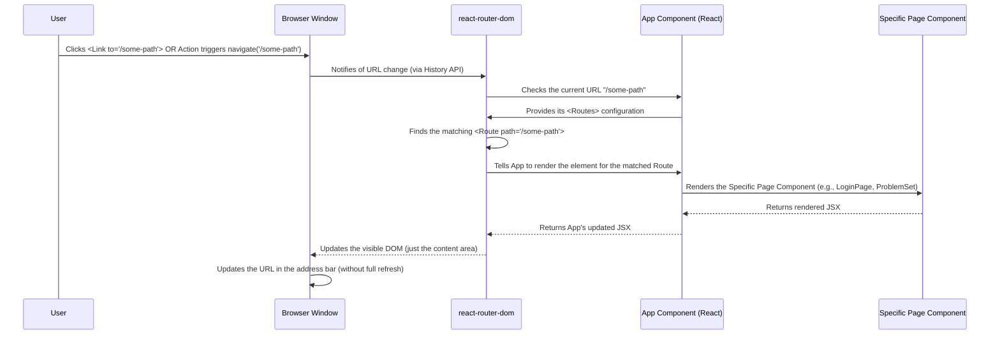

# Chapter 1: Frontend Pages and Navigation

Welcome to the FireCode tutorial! In this first chapter, we'll explore the very first thing you see and interact with when you visit a website: the different screens, or "pages", and how you move between them.

Think of the FireCode application like a building. Inside this building, there are different rooms:
*   The **Lobby** (maybe the main entrance or landing page).
*   A **Library** where you can find lots of resources (like the list of problems).
*   Specific **Study Rooms** for tackling individual problems.
*   A **Locker Room** where you manage your profile and settings.

Each of these "rooms" is a distinct screen or view that you see and interact with on the website. We call these "Frontend Pages".

But how do you get from the Lobby to the Library, or from the Library to a specific Study Room? You need hallways and signs that guide you. In a website, this is called "Navigation". It's the system that handles moving you from one page to another when you click a button or a link.

**What problem does this solve?**

Imagine a traditional website where clicking a link means your browser has to completely reload the page from the server. This is slow and feels clunky. Modern web applications, like FireCode, want to feel more like desktop applications – fast and responsive.

The concept of Frontend Pages and Navigation solves this by allowing us to switch between different views **without a full page reload**. When you click a link, the application intercepts that click, figures out which "room" (page) you want to go to, and then quickly swaps the current view for the new one, all within the same browser window. This is often called **client-side routing**.

**How FireCode Handles Pages and Navigation**

FireCode uses a popular library called `react-router-dom` to manage its pages and navigation. This library helps us define which page component should be shown for each different URL (web address) in the browser.

Let's look at the core setup in the `src/App.tsx` file:

```typescript
// src/App.tsx (Simplified)
import { BrowserRouter, Route, Routes } from "react-router-dom";
import ProblemPage from "./pages/ProblemPage";
import ProblemSet from "./pages/ProblemSet";
import LandingPage from "./pages/LandingPage";
// ... other page imports ...

function App() {
    // ... state and effect hooks ...

    return (
        <div className="App">
            {/* BrowserRouter helps react-router-dom work with the browser's URL */}
            <BrowserRouter>
                {/* Routes is where we list all possible paths */}
                <Routes>
                    {/* A Route defines a specific path and the page to show */}
                    <Route
                        path="/" // When the URL is just "/"
                        element={<LandingPage token={token} id={id} />} // Show the LandingPage
                    />
                    <Route
                        path="/problemset" // When the URL is "/problemset"
                        element={<ProblemSet token={token} id={id} />} // Show the ProblemSet page
                    />
                    {/* ... more routes ... */}
                </Routes>
            </BrowserRouter>
        </div>
    );
}

export default App;
```

*   `<BrowserRouter>`: This component wraps your entire application. It tells `react-router-dom` to listen to changes in the browser's URL and manage the history.
*   `<Routes>`: This component acts like a list or a switchboard. It looks at the current URL and finds the first `<Route>` whose `path` matches the URL.
*   `<Route>`: Each `<Route>` defines a specific mapping.
    *   `path`: This is the part of the URL that the route listens for (e.g., `/`, `/problemset`, `/login`).
    *   `element`: This is the React component (our "page") that `react-router-dom` should render when the `path` matches.

In `App.tsx`, you can see many `<Route>` components defined for different paths like `/`, `/problemset`, `/login`, `/signup`, `/settings`, and `/accounts/:name`. Each `element` points to a component located in the `src/pages/` directory, like `LandingPage`, `ProblemSet`, `LoginPage`, etc.

**Handling Dynamic URLs**

Notice the routes for problems: `/problem/:name`.

```typescript
// src/App.tsx (Snippet)
// ... imports ...
function App() {
    // ... state and effect hooks ...

    return (
        <div className="App">
            <BrowserRouter>
                <Routes>
                    {/* ... other routes ... */}
                    <Route
                        path="/problem/:name" // Matches paths like /problem/two-sums
                        element={
                            <ProblemPage
                                data={{ activeNavOption: "description" }}
                                token={token}
                                id={id}
                            />
                        }
                    />
                     <Route
                        path="/problem/:name/editorial" // Matches paths like /problem/two-sums/editorial
                        element={
                            <ProblemPage
                                data={{ activeNavOption: "editorial" }}
                                token={token}
                                id={id}
                            />
                        }
                    />
                    {/* ... other problem sub-routes ... */}
                </Routes>
            </BrowserRouter>
        </div>
    );
}

export default App;
```

The colon (`:`) before `name` (`:name`) tells `react-router-dom` that this part of the URL is dynamic. It's a placeholder for something that can change, like the name of a specific problem (e.g., `two-sums`, `reverse-string`). This allows us to use the same `ProblemPage` component to display different problems based on the URL. The component can then read this `name` from the URL to fetch the correct problem's data.

You also see more specific routes like `/problem/:name/editorial`. This allows showing different views (like description, editorial, submissions) within the `ProblemPage` based on a sub-path.

**Navigating Between Pages**

There are two main ways to navigate using `react-router-dom`:

1.  **Using `<Link>`:** This is the most common way, used for simple clickable links. It looks like a standard HTML `<a>` tag but prevents the default browser reload.

    ```typescript
    // src/pages/ErrorPage.tsx (Snippet)
    import { Link } from "react-router-dom";
    // ... component definition ...
    const ErrorPage = ({ data }: { data: ErrorPage }) => {
        return (
            <>
                {/* ... other JSX ... */}
                {data.links != undefined &&
                    data.links.length !== 0 &&
                    data.links.map((elem) => (
                        <Link
                            to={elem.link_path} // The path to navigate to
                            className="text-orange-500 hover:text-red-600 text-[14px] block w-fit mx-auto"
                        >
                            {elem.text} {/* The clickable text */}
                        </Link>
                    ))}
                {/* ... other JSX ... */}
            </>
        );
    };
    // ... export ...
    ```
    Instead of `href`, you use `to` to specify the internal application path. When the user clicks this `<Link>`, `react-router-dom` intercepts the click and renders the component associated with `/login` or `/signup` (in this example) without refreshing the entire page.

2.  **Using `useNavigate`:** Sometimes you need to navigate after some action happens, like submitting a form, logging in successfully, or deleting an account. For this, you use the `useNavigate` hook.

    ```typescript
    // src/pages/LoginPage.tsx (Snippet)
    import { useState } from "react";
    import { Link, useNavigate } from "react-router-dom";
    // ... other imports ...

    const LoginPage = ({ Data }: { Data: any /* Simplified type */ }) => {
        // ... state ...
        const navigate = useNavigate(); // Get the navigation function

        const handleLogin = () => {
            // ... login logic (axios.post) ...
            .then(({ data }) => {
                if (data.success === false) {
                    setMessage(data.message);
                    return;
                }
                Data.setTokenFunction(data.token);
                Data.setIdFunction(data.id);
                navigate("/problemset"); // Navigate to /problemset after success
            })
            // ... error handling ...
        };

        return (
           // ... login form JSX ...
           <button type="button" onClick={handleLogin}>
               Login
           </button>
           // ... rest of JSX ...
        );
    };
    // ... export ...
    ```
    You call `useNavigate()` inside your component to get a `navigate` function. Then, when your logic determines it's time to change pages (e.g., after a successful login), you call `navigate('/problemset')`, and `react-router-dom` handles the rest, just like clicking a `<Link>`.

**How it Works Under the Hood (Simplified)**

Let's trace what happens when you click a `<Link>` component or trigger a `navigate('/some-path')` call:



1.  The user interacts with a navigation element (`<Link>` or a button triggering `navigate`).
2.  Instead of telling the browser to fetch a *new* HTML page from the server, `react-router-dom` intercepts this request.
3.  It uses the browser's History API (a modern browser feature) to change the URL shown in the address bar *without* a full page reload.
4.  Based on the *new* URL, `react-router-dom` looks at the `<Routes>` defined in your `App` component.
5.  It finds the `<Route>` whose `path` best matches the new URL.
6.  It then tells your React application to stop showing the *previous* page component and start showing the `element` (the new page component) defined for the matched route.
7.  React updates only the necessary parts of the webpage (rendering the new page component), making the transition feel instant and smooth.

This client-side routing is a fundamental concept in building fast, responsive single-page applications (SPAs) like FireCode.

**Conclusion**

In this chapter, we learned how FireCode organizes its different views into "Frontend Pages" and how it uses `react-router-dom` for "Navigation" to move smoothly between these pages without full reloads. We saw how the `App.tsx` file defines the mapping between URLs and components using `<Routes>` and `<Route>`, and how `<Link>` and `useNavigate` are used to trigger navigation.

Now that we understand how users move between different screens, let's look at the building blocks *within* those screens – the buttons, forms, lists, and other interactive elements that make up the user interface.

Let's move on to [Chapter 2: UI Components](02_ui_components_.md)!

---

Generated by [AI Codebase Knowledge Builder](https://github.com/The-Pocket/Tutorial-Codebase-Knowledge)