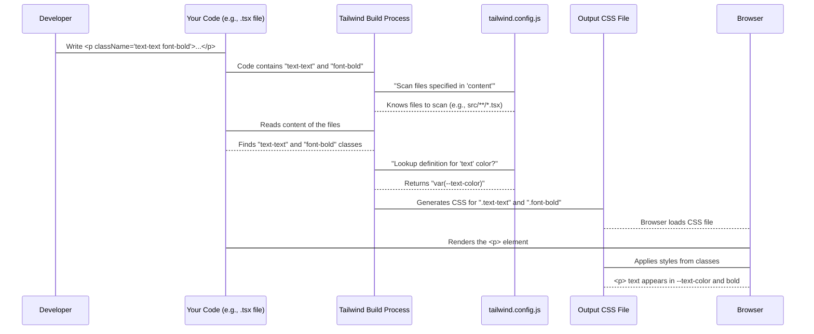

# Chapter 1: Frontend Styling

Welcome to the first chapter of the FireCode tutorial! In this chapter, we'll start exploring how this project makes things look good on your screen. We're talking about colors, fonts, spacing, and everything visual – what developers call "Frontend Styling".

Imagine you're building a house. Frontend styling is like painting the walls, choosing the furniture, and arranging everything so it looks nice and welcoming. In web development, this means making sure buttons are the right color, text is easy to read, and everything is laid out neatly.

But doing this from scratch for every single element on a webpage can be a lot of work! How do we manage all these styles efficiently? This is where our first core concept, Frontend Styling, comes in.

### What Problem Are We Solving?

The main problem is managing all the visual details of a complex application. You don't want to write custom styling rules for every single button, heading, or paragraph. You want a system that helps you apply consistent styles quickly and easily.

Let's consider a simple use case: **Making a piece of text stand out** by making it bold and using the main text color defined for the project. How do we do this in FireCode?

### Introducing Tailwind CSS

FireCode uses a popular tool called **Tailwind CSS** to handle styling. Think of Tailwind CSS as a toolbox filled with pre-made style "utilities". Instead of writing traditional CSS like this:

```css
.my-bold-text {
  font-weight: bold;
  color: #333; /* Or some other color */
}
```

and then applying the class `<p class="my-bold-text">`, Tailwind lets you add classes directly to your HTML or JSX elements that *already* represent styles.

This approach is called "**utility-first**". It means you build your designs by combining many small utility classes right in your markup.

So, to make text bold using standard Tailwind, you'd add the class `font-bold`:

```html
<p class="font-bold">This text is bold.</p>
```

And to set a text color, you'd use classes like `text-blue-500`:

```html
<p class="text-blue-500">This text is blue.</p>
```

Combining them is simple:

```html
<p class="font-bold text-blue-500">This text is blue and bold.</p>
```

This might look like a lot of classes at first, but it's incredibly fast once you get used to it, and it makes it easy to see the styles applied directly in your code.

### The Styling Control Center: `tailwind.config.js`

While Tailwind provides a vast number of utilities out of the box, you often need to customize or extend it for your specific project. This is where the `tailwind.config.js` file comes in. It's like the control panel for your Tailwind toolbox. It tells Tailwind:

1.  Where to look in your project to find the utility classes you're using.
2.  How to potentially add *new* utilities or change the default ones (like defining custom colors or spacing units).

Let's look at a simplified version of the `tailwind.config.js` file in FireCode:

```javascript
// tailwind.config.js
/** @type {import('tailwindcss').Config} */
module.exports = {
    // 1. Where to find the code using Tailwind classes
    content: ["./src/**/*.{tsx,ts,js,jsx}"],

    theme: {
        extend: {
            // 2. Adding custom colors
            colors: {
                bg: "var(--bg-color)",
                text: "var(--text-color)",
                // ... other custom colors
            },
        },
    },
    plugins: [],
};
```

Let's break this down:

*   **`content: ["./src/**/*.{tsx,ts,js,jsx}"]`**: This is crucial. It tells Tailwind *which files* to scan (`.tsx`, `.ts`, `.js`, `.jsx` files inside the `src` folder) to find the Tailwind class names you've used. During the build process, Tailwind reads these files, finds classes like `font-bold` or `text-text`, and then generates *only* the CSS needed for those specific classes. This keeps the final CSS file small and efficient.
*   **`theme.extend.colors`**: This part allows us to add *new* color names that we can use as Tailwind classes. Notice the names like `bg` and `text`. These aren't standard Tailwind color names like `blue-500`. We've *extended* Tailwind to include our own color names.

```javascript
            colors: {
                bg: "var(--bg-color)", // Adds 'bg' color utility
                text: "var(--text-color)", // Adds 'text' color utility
                // ...
            },
```

This configuration means that in our code, we can now use classes like `bg-bg` (for the background color) or `text-text` (for the main text color).

### Solving Our Use Case with the Config

Now, let's go back to our use case: **making a piece of text bold and using the project's main text color.**

Based on the `tailwind.config.js` file we saw, we know we have a custom color named `text`. So, we can use the `text-text` class for the color and `font-bold` for the weight.

Here's how you'd do it in a React/JSX file (common in the `src` folder):

```jsx
// Inside a component file (e.g., src/components/MyComponent.tsx)
function MyComponent() {
  return (
    <p className="text-text font-bold">
      Hello, FireCode! This text uses our custom text color and is bold.
    </p>
  );
}
```

**Explanation:**

*   We add `className` to the `<p>` element (in HTML it would be `class`).
*   `text-text` is a Tailwind class enabled by our `tailwind.config.js`. It tells Tailwind to apply the color defined for the `text` key, which is `var(--text-color)`.
*   `font-bold` is a standard Tailwind utility class that sets the text's font weight to bold.

When this code is processed, Tailwind looks at `text-text` and `font-bold`, finds their definitions (one custom from config, one standard), and generates the necessary CSS behind the scenes.

### How It Works Under the Hood (Simplified)

Let's trace what happens when you use a custom class like `text-text`:



1.  You write code using Tailwind classes (`text-text`, `font-bold`).
2.  During the project's build process, the **Tailwind Build Process** (often a command-line tool or integrated into a build tool) starts.
3.  It reads the `tailwind.config.js` file to know where to look (`content`).
4.  It scans your code files (`.tsx`, etc.) and finds all the Tailwind classes you've used.
5.  For each class, it looks up its definition.
    *   For `font-bold`, it finds the standard Tailwind rule (e.g., `font-weight: 700;`).
    *   For `text-text`, it looks in the `theme.extend.colors` section of `tailwind.config.js` and finds that `text` is defined as `var(--text-color)`.
6.  Tailwind generates a minimal CSS file containing *only* the rules for the classes it found (`.font-bold { ... }` and `.text-text { ... }`).
7.  The web browser loads this generated CSS file along with your HTML/JavaScript.
8.  When the browser renders your `<p>` element with `className="text-text font-bold"`, it applies the corresponding CSS rules it loaded.

This process ensures you only ship the CSS you actually use, keeping things lightweight. The `tailwind.config.js` file is key because it allows us to define our *own* color names (`text`, `bg`, etc.) and link them to something else (`var(--text-color)` in this case), which we'll explore more in the next chapter.

### Conclusion

In this chapter, we learned that FireCode uses Tailwind CSS for frontend styling, allowing us to apply visual styles quickly using utility classes like `font-bold`. We also saw how the `tailwind.config.js` file is used to configure Tailwind, telling it where to find our classes and, importantly, allowing us to define custom styles like project-specific color names (`text`, `bg`) that we can use directly in our code. These custom colors are linked to something called CSS variables.

But what are these `var(--text-color)` things, and why are we using them for colors instead of just standard color codes? This is where things get really interesting for managing themes and consistent styling across the application.

In the next chapter, we will dive into **[Color Theming](02_color_theming_.md)** to understand how FireCode uses these custom color names and CSS variables to manage the application's color palette and potentially switch between different themes (like light and dark mode).

---

Generated by [AI Codebase Knowledge Builder](https://github.com/The-Pocket/Tutorial-Codebase-Knowledge)