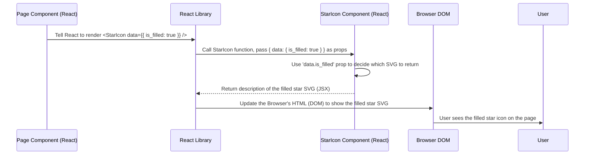

# Chapter 2: UI Components

Welcome back to the FireCode tutorial! In the [previous chapter, Chapter 1: Frontend Pages and Navigation](01_frontend_pages_and_navigation_.md), we learned how FireCode organizes its different screens into "pages" and how we navigate between them seamlessly without full page reloads, much like moving between rooms in a building.

Now, let's step *inside* one of those rooms (a page) and look at what makes up the furniture – the individual pieces you interact with like buttons, forms, lists, and more. These pieces are what we call **UI Components**.

**What Problem Do UI Components Solve?**

Imagine building a complex webpage like the problem list page on FireCode. You have a search bar, a list of problems, each with its title, difficulty, acceptance rate, like/dislike counts, and a star icon. You also have sorting options at the top.

If you had to build each of these elements – every single button, every list item's structure, every icon – from scratch every time you needed it, your code would become incredibly repetitive. Worse, if you decided to change the look of a button or the behavior of a star icon, you'd have to find and update that code *everywhere* it's used across your entire application. This is like building custom furniture for every room in our building – very time-consuming and inconsistent!

**UI Components** solve this by allowing us to create these individual pieces of the user interface as standalone, reusable blocks. Think of them like standard pieces of furniture (chairs, tables, lamps) that you can design once and then use in any room (page) where you need them.

**Key Concepts of UI Components**

1.  **Reusable Building Blocks:** A component is a self-contained piece of UI. It could be something as simple as a button or an icon, or something more complex like a full navigation bar or a list of items. The key is that you can use the same component multiple times in different places.

    *   **Analogy:** A standard chair design. You can make many identical chairs and put them in the dining room, the living room, or the study room.

2.  **Making Development Organized:** By breaking down the UI into smaller, manageable components, your code becomes easier to understand, maintain, and debug. Each file focuses on just one part of the UI.

    *   **Analogy:** Instead of having one giant blueprint for the entire building's interior, you have separate, detailed plans for each type of furniture.

3.  **Ensuring Consistency:** When you use the same component across your application, they will all look and behave the same way by default. This gives your application a consistent look and feel. If you need to change the design, you only change the component's code, and the change reflects everywhere it's used.

    *   **Analogy:** All the chairs made from the standard design will look identical. If you update the design (e.g., change the color), all *new* chairs will have the new color, and you could easily update the old ones too based on the single design.

**How FireCode Uses UI Components**

FireCode, being a modern web application, is built extensively using UI components. If you look inside the `src/components/` directory, you'll find many files, each representing a distinct piece of the UI:

*   `MainHeading.tsx`: The header bar at the very top of the page.
*   `ProblemList.tsx`: The component that displays the list of coding problems.
*   `ProblemDescription.tsx`: The component that shows the details of a single problem.
*   `CodeBlock.tsx`: A component specifically for displaying formatted code snippets.
*   `ConfirmModal.tsx`: A pop-up window used for confirmations (like logging out).
*   `Loading.tsx`: A component to show a loading indicator while waiting for data.
*   `StarIcon.tsx`: A simple component to display a star icon.
*   `Tooltip.tsx`: A component to show a small text box when you hover over something.

And many more! Each of these is a self-contained piece of the UI.

**Using a UI Component: A Simple Example**

Let's look at a very simple component, like `Loading.tsx`, and see how another component uses it.

The `Loading.tsx` component simply displays a loading animation. It might look like this inside (simplified):

```typescript
// src/components/Loading.tsx (Simplified)
const Loading = ({ For, color }: { For?: string; color?: string }) => {
    // ... logic to pick which loading animation to show based on 'For' and 'color' ...

    // Returns JSX (what React renders)
    return (
        <div className="loading-spinner">
            {/* This div and its children represent the actual spinner */}
            <div className="spinner-blade"></div>
            <div className="spinner-blade"></div>
            {/* ... more blades ... */}
        </div>
    );
};

export default Loading;
```
This `Loading` component is designed to show different styles of loading indicators depending on the `For` and `color` values passed to it.

Now, let's see how the `ProblemList.tsx` component uses `Loading.tsx`. When the problem list is sorting or loading data, `ProblemList` needs to show a loading indicator. Instead of writing the spinner HTML and CSS directly inside `ProblemList`, it just uses the `Loading` component:

```typescript
// src/components/ProblemList.tsx (Snippet)
import { useEffect, useRef, useState } from "react";
// ... other imports ...
import Loading from "./Loading"; // <-- Import the Loading component

const ProblemList = ({ data, searchFn, searchQuery }: { /* ... types ... */ }) => {
    // ... state and other logic ...

    const [isSortLoading, setIsSortLoading] = useState<boolean>(false); // State to track if sorting is happening

    const titleOnClick = async () => {
        setIsSortLoading(true); // Start loading
        // ... sorting logic ...
        await searchFn(searchQuery, newOptions);
        setIsSortLoading(false); // Stop loading
    };

    return (
        <div>
            {/* ... header row ... */}
            {/* Check if data is loading or if sorting is happening */}
            {data != undefined && data.length !== 0 && statusRef.current != null ? (
                <>
                    {isSortLoading ? ( // <-- Check the state
                        <div className="sort-loading-backdrop w-[calc(100%-18px)] h-[calc(100%-126px)] z-[180] absolute top-[100px] ">
                            <div className="relative w-full h-full">
                                <div className="absolute top-1/2 left-1/2">
                                    {/* Use the Loading component here! */}
                                    <Loading color="white" />
                                </div>
                            </div>
                        </div>
                    ) : (
                        <></> // Or render nothing if not loading
                    )}
                    {/* ... map over data to show problems ... */}
                </>
            ) : /* Check if no data is found */
            data != undefined && data.length === 0 ? (
                <div className="text-[14px] ml-[30px] text-red-600 h-[40px] leading-[40px]">
                    Problem not found
                </div>
            ) : (
                // Use Loading component when the initial data is loading
                <Loading For="pList" /> // <-- Use Loading with a different prop
            )}
        </div>
    );
};

export default ProblemList;
```

In this snippet:
1.  We `import Loading from "./Loading";` to make the `Loading` component available.
2.  We use the `Loading` component by including `<Loading color="white" />` or `<Loading For="pList" />` directly in the JSX returned by `ProblemList`.
3.  We decide *when* to show the `Loading` component based on the `isSortLoading` state or whether the initial data is available.
4.  We pass "properties" or "props" to the `Loading` component, like `color="white"` or `For="pList"`, to customize its appearance or behavior. The `Loading` component reads these props (`{ For, color }`) to render itself correctly.

This demonstrates the power of components: `ProblemList` doesn't need to know *how* to draw a loading spinner; it just needs to know *that* it can use the `Loading` component and pass it some simple instructions (`props`) on what kind of loading animation to show.

**How Components Work Under the Hood (Simplified)**

At its core, a React UI component is typically a JavaScript function (or a class) that takes properties (props) as an input and returns a description of what should appear on the screen (JSX, which React turns into HTML).

Let's trace a simple interaction, like a page rendering a `StarIcon`:



1.  A "parent" component (like `ProblemDescription.tsx`) includes `<StarIcon data={{ is_filled: true }} />` in the JSX it returns.
2.  React sees this and knows it needs to render the `StarIcon` component.
3.  React calls the `StarIcon` function, passing the specified `data` as a JavaScript object argument (which we call `props`).
4.  Inside the `StarIcon` function, it checks the `props.data.is_filled` value.
5.  Based on that value, the function returns the correct JSX to display either a filled star SVG or an outline star SVG.
6.  React takes the returned JSX from `StarIcon` and figures out how to update the actual HTML structure in the browser's window (the DOM).
7.  The browser displays the updated HTML, and the user sees the correct star icon.

Let's look at the `StarIcon.tsx` code snippet to see this in action:

```typescript
// src/components/StarIcon.tsx (Simplified)
// Define the expected data structure for the prop
const StarIcon = ({ data }: { data: StarData }) => {
    // Check the 'is_filled' property from the 'data' prop
    return (
        <div style={{ width: data.width, height: data.height }}>
            {data.is_filled ? ( // Conditional rendering based on the prop
                <svg> {/* ... SVG code for a filled star ... */} </svg>
            ) : (
                <svg> {/* ... SVG code for an outline star ... */} </svg>
            )}
        </div>
    );
};

export default StarIcon;
```

*   The `StarIcon` function takes one argument, `{ data }`, which is the prop object.
*   It uses a ternary operator (`condition ? value_if_true : value_if_false`) to conditionally render one `<svg>` block (the filled star) if `data.is_filled` is `true`, or another `<svg>` block (the outline star) if it's `false`.
*   It also uses `data.width` and `data.height` props to set the size of the surrounding `div`.
*   This component is purely controlled by its inputs (props). Given the same `data`, it will always render the same output.

Components can also have their own internal **state** using hooks like `useState`. This allows them to manage data that changes over time and affects their appearance or behavior *without* being told by a parent component. For example, the `ConfirmModal.tsx` component likely uses `useState` to track whether it should currently be displayed or hidden. When you click the "Cancel" button, the component updates its own internal state, causing it to hide itself.

**Conclusion**

In this chapter, we learned about UI Components – the reusable building blocks of FireCode's user interface. We saw how they help organize development, ensure consistency, and make it easier to build complex pages by composing smaller pieces. We looked at examples like `Loading` and `StarIcon` and understood how components take `props` to customize their output and return JSX that React uses to update the browser display.

Now that we know how to build the visual parts of our application, let's think about who is using these parts – the users – and how we manage their identities and accounts.

Let's move on to [Chapter 3: User Authentication and Accounts](03_user_authentication_and_accounts_.md)!

---

Generated by [AI Codebase Knowledge Builder](https://github.com/The-Pocket/Tutorial-Codebase-Knowledge)