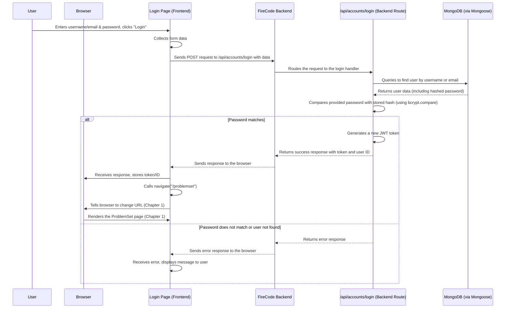

# Chapter 3: User Authentication and Accounts

Welcome back, aspiring FireCoder! In the [previous chapter, Chapter 2: UI Components](02_ui_components_.md), we explored the building blocks of our user interface – the reusable buttons, forms, and other elements that make up a page. Now that we know how to display information and interact with users, let's talk about *who* is using our application and how we manage their identity.

Imagine FireCode is a bustling library filled with challenging coding problems (the books). Anyone can walk into the lobby (the landing page) and look around. But to take out a book (submit a solution to a problem) or access your personal study history (view your profile), you need a library card.

**User Authentication and Accounts** is like the library's system for managing these library cards. It handles everything related to knowing who you are, letting you get a card, checking if your card is valid, and keeping track of your borrowing history.

**What problem does this solve?**

Without a way to identify users:
*   How can we save your progress on problems?
*   How can we track which problems you've solved?
*   How can you have a personalized profile page?
*   How can we prevent just anyone from performing actions that should only be for registered users (like deleting an account)?

The "User Authentication and Accounts" part of FireCode solves this by providing a secure way for users to sign up, log in, and for the application to verify their identity when they perform certain actions.

**Key Concepts**

This abstraction involves a few core ideas:

1.  **User Account:** This is the digital record of a user. It stores information about them, like their username, email, password (in a secure, hidden form!), solved problems, starred problems, etc. Think of it as your personal file in the library's system.
2.  **Authentication:** This is the process of verifying that a user is who they say they are. The most common form is logging in: you provide a username/email and password, and the system checks if they match a valid account. It's proving you have a valid library card.
3.  **Authorization:** Once you're authenticated (logged in), authorization determines *what* you are allowed to do. Can you view your own profile? Can you delete your account? Can you submit a solution? (While authentication is covered in this chapter, authorization is often handled by [Middleware](07_middleware_.md) or specific checks within [API Routing](08_api_routing_.md) logic). This is like checking if your library card is allowed to take out certain types of books or use specific study rooms.

**How FireCode Handles User Accounts and Authentication**

FireCode needs both the **frontend** (what the user sees) and the **backend** (the server logic) to work together for user accounts and authentication.

**On the Frontend (What You See and Interact With):**

You interact with this system through pages like:

*   `/signup` (SignupPage): Where you create a new account.
*   `/login` (LoginPage): Where you log in to an existing account.
*   `/accounts/:name` (ProfilePage): Where you can view a user's public profile.
*   `/settings` (SettingPage): Where you can manage your account settings (like deleting it).

These pages use forms to collect information (username, email, password) and then send this information to the backend.

Let's look at a simplified part of the `LoginPage.tsx`:

```typescript
// src/pages/LoginPage.tsx (Snippet)
import axios, { AxiosError } from "axios";
import { useState } from "react";
import { Link, useNavigate } from "react-router-dom";
import { API_URL } from "../App";
// ... other imports ...

const LoginPage = ({ Data }: { Data: any /* Simplified type */ }) => {
    const [usernameOrEmail, setUsernameOrEmail] = useState("");
    const [password, setPassword] = useState("");
    const navigate = useNavigate(); // Get the navigation function (from Chapter 1)

    const handleLogin = () => {
        // 1. Prepare the data from the input fields
        const loginData = {
            username_or_email: usernameOrEmail,
            password: password,
        };

        // 2. Send the data to the backend /api/accounts/login endpoint
        axios.post(`${API_URL}/api/accounts/login`, loginData)
            .then(({ data }) => {
                // 3. Handle the successful response
                if (data.success === false) {
                    // Show an error message if login failed
                    // setMessage(data.message);
                    return;
                }
                // If successful, store the token and user ID
                Data.setTokenFunction(data.token); // Save the token
                Data.setIdFunction(data.id);       // Save the user ID
                navigate("/problemset");           // Go to the problem list page (Chapter 1)
            })
            .catch((e: AxiosError) => {
                // 4. Handle errors (like wrong password or network issues)
                 // setMessage(...);
            });
    };

    return (
       // ... login form JSX using useState for inputs ...
       <button type="button" onClick={handleLogin}>
           Login
       </button>
       // ... rest of JSX ...
    );
};
// ... export ...
```
This simplified code shows how the frontend `LoginPage` collects the user's input, uses the `axios` library to send this data as a POST request to a specific backend URL (`/api/accounts/login`), and then processes the response. If the login is successful, it receives a `token` and `id`, saves them (likely in the browser's storage), and navigates the user to another page using the `navigate` function from [Chapter 1: Frontend Pages and Navigation](01_frontend_pages_and_navigation_.md).

**On the Backend (The Server Doing the Work):**

The backend receives these requests and performs the heavy lifting:

1.  **Defining the User:** The structure of user data is defined using Mongoose (which interacts with MongoDB, as we'll see in [Chapter 6: Data Persistence (MongoDB/Mongoose)](06_data_persistence__mongodb_mongoose__.md)).

    ```typescript
    // server/models/user.ts (Snippet)
    import mongoose, { Document } from "mongoose";

    // Define what a User document looks like in the database
    interface DUser extends Document {
        username: string;
        email: string;
        password: string; // Stored securely!
        submissions: Submission[] | undefined;
        problems_starred: string[];
        problems_solved: string[];
        // ... other user stats ...
    }

    // Define the Mongoose Schema based on the interface
    const userSchema = new mongoose.Schema<DUser>({
        username: { type: String, required: true },
        email: { type: String, required: true },
        password: { type: String, required: true },
        submissions: Array,
        problems_starred: Array,
        problems_solved: Array,
        // ... other fields with default values ...
    });

    // Create the Mongoose Model
    const UserModel = mongoose.model<DUser>("User", userSchema);

    export default UserModel;
    ```
    This code defines the blueprint for a `User` document in the database, specifying the types of data each user record will hold.

2.  **Handling Requests (API Routes):** The `server/routes/accounts.ts` file contains the code that listens for requests to URLs like `/api/accounts/signup`, `/api/accounts/login`, etc. (We'll dive deeper into [API Routing](08_api_routing_.md) later).

    ```typescript
    // server/routes/accounts.ts (Snippet - Signup)
    import express from "express";
    import bcrypt from "bcrypt"; // Used for securely hashing passwords
    import UserModel from "../models/user"; // Our User blueprint
    import { existsEmail, existsUsername } from "../utils/utils"; // Helpers (Chapter 9)
    import jwt from "jsonwebtoken"; // Used to create tokens
    // ... other imports ...

    const accounts = express.Router(); // Create a mini-application for account routes

    accounts.post("/signup", async (req, res) => {
        try {
            const { username, email, password } = req.body; // Get data from the request

            // --- Basic Validation and Checks ---
            if (!username || !email || !password) {
                res.status(400).json({ success: false, message: "Missing fields." }); return;
            }
            // Check password strength, username format, bad words filter...
            // ... (omitted for brevity) ...

            // Check if user/email already exists (using database queries from Chapter 6)
            if (await existsUsername(username)) {
                res.status(409).json({ success: false, message: "Username exists." }); return;
            }
            // ... check email ...

            // --- Securely Hash the Password ---
            const hashedPas = await bcrypt.hash(password, 10); // Hash the password securely!

            // --- Create and Save New User ---
            const newUser = new UserModel({ // Create a new user instance
                username: username,
                email: email,
                password: hashedPas, // Store the HASHED password
            });
            await newUser.save(); // Save the user to the database (Chapter 6)

            // --- Generate Authentication Token ---
            // Find the saved user to get their ID
            const userFromDb = await UserModel.findOne({ username: username });
            const id = userFromDb ? userFromDb.id.toString() : "none";

            // Create a token (like a temporary passport)
            const token = jwt.sign(userFromDb.username, process.env.ACCESS_TOKEN_SECRET!); // Token includes username

            console.log(`User '${username}' signed up.`); // Log for server monitoring
            res.status(201).json({ // Send success response with token and ID
                token: token,
                id: id,
                success: true,
                message: "Account created successfully",
            });

        } catch (e) {
             res.status(500).json({ success: false, message: "Error creating account" });
        }
    });
    // ... other routes (/login, /delete/:id, /id/:id, /:name) ...
    export default accounts;
    ```
    This code handles the `/signup` request: it takes the user's data, performs validation, securely hashes the password using `bcrypt` (so the original password is never stored or known), creates a new user record in the database, generates a JWT (JSON Web Token) which acts as a temporary key for the user, and sends this token and the user's database ID back to the frontend.

    The `/login` route (`accounts.post("/login", ...)` in the same file) works similarly: it finds the user by username or email, uses `bcrypt.compare` to check if the provided password matches the stored hash, and if successful, generates and returns a new token and ID.

3.  **Protecting Routes (Middleware):** Once a user is logged in and has a token, they might try to access routes that require them to be authenticated, like viewing their profile or deleting their account. This is where the authentication middleware comes in.

    ```typescript
    // server/middlewares/token.ts (Snippet)
    import { NextFunction } from "express";
    import express from "express";
    import jwt from "jsonwebtoken"; // Used to verify tokens
    require("dotenv"); // To access ACCESS_TOKEN_SECRET

    interface UserRequest extends express.Request {
        user?: string; // Add a property to store the decoded user info
    }

    export function authenticateToken( // This is our middleware function
        req: UserRequest,
        res: express.Response,
        next: NextFunction // Function to call the next middleware/route handler
    ) {
        // 1. Get the token from the request headers (usually 'Authorization')
        const authHeader = req.headers["authorization"];
        const token = authHeader; // Assuming the token is directly in Authorization header

        if (!token) {
            // 2. If no token is provided, deny access
            return res.status(401).json({ success: false, message: "Token not provided" });
        }

        // 3. Verify the token using the secret key
        jwt.verify(token, process.env.ACCESS_TOKEN_SECRET!, (err, decoded) => {
            if (err) {
                // 4. If verification fails (invalid or expired token), deny access
                return res.status(403).json({ success: false, message: "Invalid token" });
            }
            // 5. If verification succeeds, attach the decoded user info to the request
            req.user = decoded?.toString(); // decoded contains the username from the token
            next(); // 6. Allow the request to proceed to the next handler (the actual route logic)
        });
    }
    ```
    This `authenticateToken` function is a piece of middleware (we'll learn more about [Middleware](07_middleware_.md) in Chapter 7). Routes that need protection (like `/api/accounts/delete/:id` or `/api/accounts/id/:id`) use this middleware *before* running their main logic. The middleware checks if the request includes a valid token. If not, or if the token is invalid, it sends an error response. If the token is valid, it attaches the decoded user information (like the username) to the request object and allows the request to continue to the route handler.

    You can see this middleware being used in the routes:

    ```typescript
    // server/routes/accounts.ts (Snippet showing middleware usage)
    // ... imports ...
    import { authenticateToken } from "../middlewares/token"; // Import the middleware
    // ... accounts router setup ...

    // This route requires a valid token to access
    accounts.post("/delete/:id", authenticateToken, async (req, res) => {
        // If we reach here, authenticateToken successfully verified the user
        try {
            const { id } = req.params;
            // We could also verify req.user (the username from the token) matches the user ID being deleted
            await UserModel.findByIdAndDelete(id); // Delete the user from the database
            res.json({ success: true, message: "Account deleted successfully" });
        } catch (e) {
            res.json({ success: false, message: e });
        }
    });

    // This route also requires a valid token
    accounts.get("/id/:id", authenticateToken, async (req, res) => {
        // Again, token verified
        const id = req.params.id;
        // Fetch user by ID...
        // ... return user data ...
    });

    // This route DOES NOT require a token (public profile view)
    accounts.get("/:name", async (req, res) => {
        // Fetch public user data by username...
        // ... return data ...
    });
    ```
    Notice how `authenticateToken` is passed as an argument between the route path (`"/delete/:id"`) and the final request handler function (`async (req, res) => { ... }`). This tells Express (our web framework) to run the `authenticateToken` middleware *first* for these specific routes.

**How it Works Under the Hood (Simplified Login Flow)**

Let's trace what happens when a user clicks the "Login" button:



1.  The user types their credentials into the form on the `LoginPage`.
2.  When they submit, the frontend code (in `LoginPage.tsx`) gathers this data.
3.  It uses `axios` to send a POST request containing this data to the backend URL `/api/accounts/login`.
4.  The FireCode backend receives this request and routes it to the specific handler function defined for the `/login` route in `server/routes/accounts.ts`.
5.  The backend handler queries the database (using `UserModel.findOne`) to find a user matching the provided username or email.
6.  If a user is found, the backend uses `bcrypt.compare` to check if the password they typed matches the securely stored password hash for that user.
7.  If the passwords match, the backend creates a unique **JSON Web Token (JWT)** using `jsonwebtoken`. This token contains basic user information (like username) and is signed with a secret key only the server knows. It's like getting a temporary, tamper-proof pass after showing your ID.
8.  The backend sends a success response back to the frontend, including the newly created token and the user's database ID.
9.  The frontend `LoginPage` receives this success response. It saves the token and ID (usually in browser local storage so it persists even if the user closes the tab).
10. Finally, the frontend uses `useNavigate` (from [Chapter 1](01_frontend_pages_and_navigation_.md)) to redirect the user to the problem set page (`/problemset`), which likely requires a valid token to fetch user-specific data.

When the user later navigates to a protected page (like `/settings`) or makes a request that needs their identity (like deleting their account), the frontend code includes the saved token in the request headers. The `authenticateToken` middleware on the backend intercepts this request, verifies the token's signature using the secret key, decodes it to get the user's identity, and then allows the request to proceed to the intended route handler only if the token is valid.

**Conclusion**

In this chapter, we learned how FireCode handles the crucial aspects of user identity through **User Authentication and Accounts**. We explored the concepts of user accounts, authentication (proving identity), and authorization (what you can do). We saw how the frontend provides pages for signing up and logging in, sending data to the backend. On the backend, we looked at how user data is structured using a Mongoose model, how dedicated routes handle signup and login requests (including secure password hashing and token generation), and how middleware is used to protect certain routes by verifying a user's token.

Understanding how users are identified and verified is essential for building personalized experiences and protecting sensitive data.

Now that we know how to manage users and their identities, let's look at a core feature of FireCode: running and submitting code!

Let's move on to [Chapter 4: Code Execution and Submission](04_code_execution_and_submission_.md)!

---

Generated by [AI Codebase Knowledge Builder](https://github.com/The-Pocket/Tutorial-Codebase-Knowledge)