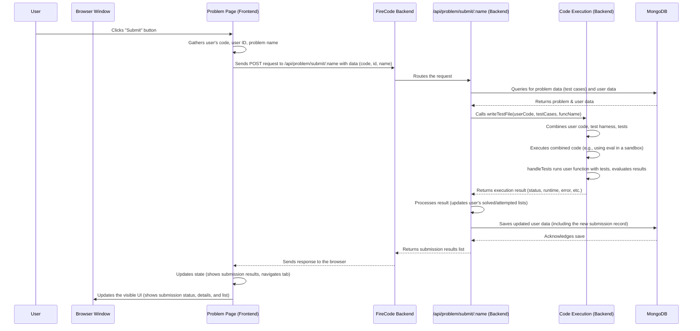

# Chapter 4: Code Execution and Submission

Welcome back! In the [previous chapter, Chapter 3: User Authentication and Accounts](03_user_authentication_and_accounts_.md), we learned how FireCode identifies and manages users – how you get your "library card" and log in. Now that you're logged in, it's time to actually *use* the library to solve problems!

The core activity on FireCode is writing code to solve a problem. But how does the website know if your code is correct? This is where the concept of **Code Execution and Submission** comes in. It's the engine that takes your code, runs it, checks the answers, and keeps a record of your attempts.

**What Problem Does This Solve?**

Imagine you've written a brilliant solution to a coding challenge. How do you prove it works, not just for the simple example you see, but for *all* the tricky cases the problem setter might have thought of? Manually testing every possible input would be impossible.

Code Execution and Submission solves this by automating the testing process. It's like having a super-fast, tireless assistant who takes your code, runs it against a secret list of test cases (inputs and their correct outputs), and immediately tells you if your code passed or failed, and why. This allows you to quickly iterate on your solution until it's perfect.

**Key Concepts**

This system involves several parts working together:

1.  **Submission:** You write your code and send it to the FireCode server.
2.  **Test Cases:** Each problem comes with a set of hidden inputs and their corresponding correct outputs, defined by the problem creator.
3.  **Execution Environment:** The server needs a safe place to run potentially untrusted user code. This is like a secure testing lab.
4.  **Execution:** Your code is run within the execution environment, using the problem's test case inputs.
5.  **Evaluation:** The output of your code for each test case is compared to the problem's expected output.
6.  **Result:** Based on the evaluation, the submission is given a status (e.g., "Accepted", "Wrong Answer", "Runtime Error").
7.  **Saving:** The details of your attempt, including your code and the result, are saved to your user account.

**How FireCode Handles Code Execution and Submission**

Let's look at this from the user's perspective first, then peek behind the curtain at the server.

**On the Frontend (The Problem Page):**

When you're on a specific problem page (`/problem/:name`), you see a code editor and buttons like "Submit".

```typescript
// src/pages/ProblemPage.tsx (Simplified Snippet)
import React, { useState } from "react";
import ReactCodeMirror from "@uiw/react-codemirror";
import { loadLanguage } from "@uiw/codemirror-extensions-langs";
import { tokyoNight } from "@uiw/codemirror-theme-tokyo-night";
import axios from "axios"; // To send data to the backend
import { useNavigate, useParams } from "react-router-dom"; // From Chapter 1
import { API_URL } from "../App";

const ProblemPage = ({ token, id }: { token: string | null; id: string | null; }) => {
    const [code, setCode] = useState<string>(""); // State to hold the user's code
    const [isSubmitLoading, setIsSubmitLoading] = useState<boolean>(false); // To show loading state
    const [submissionData, setSubmissionData] = useState<Submission[]>(); // To store submission results
    const [isSubmitted, setIsSubmitted] = useState<boolean>(false); // To know if a submission was made
    const navigate = useNavigate();
    const { name } = useParams(); // Get the problem name from the URL (Chapter 1)

    const submitCode = () => {
        setIsSubmitLoading(true); // Show loading indicator
        if (!id || !name) {
            console.log("User ID or Problem name not found.");
            setIsSubmitLoading(false);
            return;
        }

        const problem_name = name;
        // Use axios to send the code to the backend
        axios
            .post(`${API_URL}/api/problem/submit/${name}`, {
                code, // The code from the editor
                id,   // The user's ID (from Chapter 3)
                problem_name, // The problem's name
            })
            .then(({ data }) => {
                // Handle the response from the backend
                setIsSubmitted(true); // Mark as submitted
                setSubmissionData(data); // Save the submission results
                navigate(`/problem/${name}/submissions`); // Navigate to the submissions tab (Chapter 1)
                setIsSubmitLoading(false); // Hide loading indicator
            })
            .catch((err) => {
                // Handle errors during submission
                console.error(err);
                setIsSubmitLoading(false);
                setIsSubmitted(true); // Still mark as submitted to show error state
            });
    };

    return (
        <div>
            {/* ... other page elements like problem description ... */}
            <ReactCodeMirror // The code editor component
                value={code} // Display the 'code' state
                // ... editor configuration (language, theme) ...
                onChange={(value) => {
                    setCode(value); // Update 'code' state when user types
                }}
            />
            <button onClick={submitCode}> {/* The submit button */}
                {isSubmitLoading ? "Loading..." : "Submit"}
            </button>
            {/* ... component to display submission results (Submissions.tsx) ... */}
        </div>
    );
};

export default ProblemPage;
```

*   The `ProblemPage` component uses `useState` to keep track of the code currently in the editor (`code`) and whether a submission is in progress (`isSubmitLoading`).
*   When you type, the `onChange` handler of the `ReactCodeMirror` updates the `code` state.
*   When you click the "Submit" button, the `submitCode` function is called.
*   This function uses `axios` (as seen in [Chapter 3](03_user_authentication_and_accounts_.md) for login) to send a POST request to the backend URL `/api/problem/submit/:name`.
*   It includes your code, your user ID (obtained after login, likely stored in browser and passed down via props/context), and the problem name in the request body.
*   After the backend responds, the frontend updates its state (`isSubmitted`, `submissionData`) to display the results and uses `navigate` (from [Chapter 1](01_frontend_pages_and_navigation_.md)) to switch to the "Submissions" view of the problem page.

The results are then displayed using UI components like `Submissions.tsx` and `CodeBlock.tsx`.

```typescript
// src/components/Submissions.tsx (Simplified Snippet)
import CodeBlock from "./CodeBlock"; // Component to display code/text

const Submissions = ({ data }: { data: SubmissionsData }) => {
    const latestSubmission = data?.submissions_list?.[0]; // Get the most recent submission

    if (!latestSubmission) {
        return <div className="text-center">No submissions found</div>;
    }

    const { status, error, runtime, memory, input, expected_output, user_output } = latestSubmission;

    return (
        <div>
            <div className={`font-bold text-[22px] ${status === "Accepted" ? "text-green-500" : "text-red-600"}`}>
                {status} {/* Display the submission status */}
            </div>

            {/* Display error message if not Accepted */}
            {error && status !== "Accepted" && (
                <div>Error Message: <code>{error}</code></div>
            )}

            {/* Display runtime/memory if Accepted */}
            {status === "Accepted" && (
                <div>
                    <span>Runtime: {Math.round(runtime)}ms</span>
                    <span>Memory: {Math.round(memory)}MB</span>
                </div>
            )}

            {/* Display I/O if Wrong Answer */}
            {status === "Wrong Answer" && (
                <div>
                    <div>Input:</div>
                    <CodeBlock input={input || ""} status={status} /> {/* Use CodeBlock */}
                    <div>Expected Output:</div>
                    <CodeBlock input={expected_output || ""} status={status} />
                    <div>Your Output:</div>
                    <CodeBlock input={user_output || ""} status={status} />
                </div>
            )}

            {/* Display a list of previous submissions */}
            {data?.submissions_list?.length > 0 && (
                <div>
                    {data.submissions_list.map((elem) => (
                        <div key={elem.time.toISOString()}>
                             {/* Display status, time, etc for each submission */}
                            Status: {elem.status}, Time: {new Date(elem.time).toLocaleDateString()}
                        </div>
                    ))}
                </div>
            )}
        </div>
    );
};

export default Submissions;
```

The `Submissions` component receives the list of submissions for the current problem from the `ProblemPage`. It typically shows the most recent submission's detailed result (status, error, runtime, memory, input/output for "Wrong Answer") and lists previous attempts. It uses the `CodeBlock` component to format and display the code snippets (input, expected output, user output).

**On the Backend (The Testing Machine):**

The backend receives the submission request and does the heavy lifting:

1.  **Receiving the Code:** The `server/routes/problem.ts` file has a specific route handler for `/api/problem/submit/:name`.

    ```typescript
    // server/routes/problem.ts (Snippet - Submit Route)
    import express from "express";
    import { writeTestFile } from "../utils/createTest"; // Our helper to run code
    import ProblemModel from "../models/problem"; // To get problem data
    import UserModel from "../models/user"; // To save user's submission
    import { Submission } from "../types/general"; // Submission type definition

    const problem = express.Router();

    // Route to handle code submission
    problem.post("/submit/:name", async (req, res) => {
        const { name } = req.params; // Problem name from URL
        const { id, code, problem_name } = req.body; // Data from frontend

        try {
            // 1. Find the problem and user data
            const problem = await ProblemModel.findOne({"main.name": name});
            const user = await UserModel.findById(id);

            if (!user || !problem) {
                // Handle case where user or problem isn't found
                return res.status(404).json([{
                    problem_name: problem_name, status: "Runtime Error",
                    error: "User or problem not found", time: new Date(),
                    runtime: 0, language: "JavaScript", memory: 0, code_body: code
                }]);
            }

            // 2. Get existing submissions or initialize list
            let history: Submission[] = user.submissions || [];

            // 3. Execute the code against test cases
            const executionResult = await writeTestFile(
                code, // User's code
                problem.test, // Test cases from the problem data
                problem.function_name // Name of the function to call in user's code
            );

            // 4. Format the new submission result
            let newSubmission: Submission = {
                problem_name: problem_name,
                status: executionResult.stdout.status, // Result like "Accepted"
                error: executionResult.stdout.error_message, // Error message if any
                time: new Date(executionResult.stdout.date),
                runtime: executionResult.stdout.runtime,
                language: "JavaScript", // Assuming JS for now
                memory: Math.random() * 80, // Placeholder for memory (actual measurement is complex)
                code_body: code, // Save the user's code
                input: executionResult.stdout.input, // Input for wrong answer
                expected_output: executionResult.stdout.expected_output, // Expected for wrong answer
                user_output: executionResult.stdout.user_output, // User's output for wrong answer
            };

            // 5. Add the new submission to the beginning of the history
            const updatedHistory = [newSubmission, ...history];

            // 6. Update user stats (solved/attempted)
            if (newSubmission.status === "Accepted") {
                if (!user.problems_solved.includes(problem_name)) {
                    user.problems_solved.push(problem_name);
                    user.problems_solved_count = (user.problems_solved_count || 0) + 1;
                }
            } else {
                if (!user.problems_attempted.includes(problem_name)) {
                    user.problems_attempted.push(problem_name);
                }
            }

            // 7. Save the updated user data to the database (Chapter 6)
            user.submissions = updatedHistory;
            await user.save();

            // 8. Send back the submissions for this problem to the frontend
            const subsByName = updatedHistory.filter(elem => elem.problem_name === problem_name);
            res.json(subsByName);

        } catch (e) {
            // Handle errors during execution or saving
            console.error("Submission Error:", e);
            // Send a generic Runtime Error back
             res.status(500).json([{
                problem_name: problem_name, status: "Runtime Error",
                error: "Internal Server Error during execution", time: new Date(),
                runtime: 0, language: "JavaScript", memory: 0, code_body: code
            }]);
        }
    });
    // ... other problem routes ...
    export default problem;
    ```
    This route handler fetches the problem details (including test cases) and the user's data from the database (using `ProblemModel` and `UserModel`, referencing [Chapter 6: Data Persistence](06_data_persistence__mongodb_mongoose__.md)). It then calls a crucial helper function, `writeTestFile`, to execute the code.

2.  **Executing the Code (`writeTestFile`):** The actual execution happens within the `server/utils/createTest.ts` file. This function takes the user's code, the test cases, and the expected function name. It does something clever (and simplified for this tutorial): it creates a self-executing JavaScript function that combines the user's code, a helper test function (`handleTests`), and the test cases, and then runs this combined code using `eval`.

    ```typescript
    // server/utils/createTest.ts (Simplified Snippet)
    import acorn from "acorn"; // Used to check code syntax

    // Helper function to run tests (simplified structure)
    let handleTestFunction = `
    function handleTests(testCases, func) {
        // This function runs the user's 'func' for each test case
        // It compares func's output to the expected output
        // It tracks status (Accepted, Wrong Answer) and errors (Runtime Error)
        // It builds a result object/string summarizing the outcome
        // ... actual logic involves looping through testCases, calling func, comparing results ...
        let status = "Accepted"; // Assume accepted initially
        let errorMessage = undefined;
        let runtime = 0;
        let input = undefined;
        let expected_output = undefined;
        let user_output = undefined;
        const date = new Date();

        try {
            const t1 = performance.now();
            // !!! DANGER: Simplification, actual implementation needs stronger sandboxing !!!
            // In reality, you'd run this in a separate process, potentially a container
            for(const testCase of testCases) {
                 const inputs = testCase.slice(0, -1);
                 const expected = testCase[testCase.length - 1];
                 const output = func(...inputs); // CALLING USER's FUNCTION
                 if (JSON.stringify(output) !== JSON.stringify(expected)) {
                      status = "Wrong Answer";
                      input = JSON.stringify(inputs);
                      expected_output = JSON.stringify(expected);
                      user_output = JSON.stringify(output);
                      errorMessage = \`Wrong Answer on test case.\`;
                      break; // Stop on first failure
                 }
            }
            runtime = performance.now() - t1;

        } catch (e) {
             status = "Runtime Error";
             errorMessage = String(e);
        }


        // Return a string formatted like JSON
        return \`{ "status":"\${status}","date":"\${date}","runtime": "\${runtime}",
        "error_message": "\${errorMessage}", "input": "\${input}",
        "expected_output":"\${expected_output}", "user_output":"\${user_output}" }\`;
    }`;


    export function writeTestFile(
        codeBody: string, // User's code string
        testCases: any[][], // Array of test cases
        functionName: string // Name of the user's function
    ): Promise<WriteFileOut> { // Returns a Promise with the result
        try {
            // Basic syntax check first
            acorn.parse(codeBody, { ecmaVersion: 2022 });
        } catch (e) {
            // If syntax is bad, return a syntax error immediately
             return Promise.resolve({
                stdout: { status: "Runtime Error", date: new Date(), runtime: 0, error_message: "Syntax Error: " + e, ...},
                stdout_string: String(e), stderr: "", code_body: codeBody
             });
        }

        // Combine user code, test runner, and test cases into a single string
        let codeToExecute =
            "(function() { try {" +
            codeBody + // User's code
            handleTestFunction + // Our test runner function
            `try { return (handleTests(${JSON.stringify(testCases)}, ${functionName})); } catch (e) { return ('{ "status":"Runtime Error", "error_message":"Error during test execution: " + e, ...}'); }` + // Call handleTests with user's function and tests
            `} catch (e) { return ('{ "status":"Runtime Error", "error_message":"Execution Error: " + e, ...}'); } })()`; // Catch errors during setup

        return new Promise((resolve, reject) => {
            try {
                // !!! DANGER: Using eval is risky! This is for demonstration. !!!
                // In a real system, you'd use a secure sandbox (like a separate process or container)
                const rawStdout = eval(codeToExecute); // Run the combined code!
                const result = JSON.parse(rawStdout); // Parse the JSON string output

                console.log("Code execution result:", result);
                resolve({
                    stdout: result,
                    stdout_string: rawStdout,
                    stderr: "", // No stderr for this simple eval method
                    code_body: codeBody,
                });
            } catch (error) {
                console.error("Error during eval:", error);
                // If eval itself fails (very unlikely with outer try/catch but good practice)
                reject({
                    stdout: { status: "Runtime Error", error_message: "Unexpected execution failure.", ... },
                    stdout_string: "", stderr: String(error), code_body: codeBody
                });
            }
        });
    }

    interface WriteFileOut { // Define the structure of the result
        stdout?: {
            status: "Accepted" | "Wrong Answer" | "Runtime Error";
            date: Date; runtime: number; error_message?: string;
            input?: string; expected_output?: any; user_output?: any;
        };
        stdout_string: string;
        stderr: string;
        code_body: string;
    }
    ```
    The `writeTestFile` function first does a basic syntax check using `acorn`. If the syntax is valid, it constructs a single string containing the user's code, the `handleTests` helper function, and a call to `handleTests` using the problem's test cases and the user's function name. It then uses `eval()` to run this combined string. The `handleTests` function within that executed code is responsible for looping through test cases, calling the user's function with test inputs, comparing the output, and determining the status ("Accepted", "Wrong Answer"). It formats the result into a JSON string, which `eval` returns. `writeTestFile` then parses this JSON string into an object and resolves the promise with the result.
    *Note: Using `eval` to run arbitrary user code is highly discouraged in production systems due to security risks. A real-world competitive programming platform would use secure sandboxing technologies like Docker containers or specialized runner environments.*

3.  **Evaluating the Result (`handleTests`):** (Covered structurally within the `writeTestFile` explanation above). The `handleTests` function (built into the string executed by `eval`) is the part that implements the problem's specific testing logic. It knows the inputs and the expected outputs and compares them to what the user's function returns.
4.  **Saving the Submission:** Once the `writeTestFile` promise resolves with the result, the `/submit/:name` route handler updates the user's document in the database with the new submission record and potentially updates their solved/attempted problem lists. This involves interacting with the `UserModel` and the database, which we'll cover more in [Chapter 6: Data Persistence (MongoDB/Mongoose)](06_data_persistence__mongodb_mongoose__.md).

**How it Works Under the Hood (Simplified Submission Flow)**

Let's trace the journey from clicking "Submit" to seeing the result:



1.  You click the "Submit" button on the `ProblemPage`.
2.  The frontend gathers your code, your user ID, and the problem name.
3.  An `axios` POST request is sent to the backend's `/api/problem/submit/:name` endpoint.
4.  The backend receives the request and the `submit/:name` route handler takes over.
5.  It fetches the problem's test cases and your user record from the database.
6.  It calls the `writeTestFile` helper function, passing your code, the test cases, and the function name the tests should call.
7.  `writeTestFile` prepares a script that runs your code against the tests and evaluates the result within a controlled environment (like the simplified `eval` approach shown).
8.  The result of the execution (e.g., "Accepted", "Wrong Answer", details about the failure) is returned to the route handler.
9.  The route handler updates your user record in the database, adding the new submission to your history and potentially marking the problem as solved or attempted.
10. The backend sends the list of submissions for that problem back to the frontend.
11. The frontend `ProblemPage` receives the results, updates its display, and potentially navigates you to the submissions tab to see the details.

This entire process, from hitting "Submit" to seeing the result, happens automatically thanks to the Code Execution and Submission system.

**Conclusion**

In this chapter, we demystified the "magic" behind solving problems on FireCode. We learned that Code Execution and Submission is the system that takes your code, runs it against hidden test cases on the server, evaluates the outcome, and records your attempt. We saw how the frontend sends your code via an API call and displays the results, and how the backend fetches problem data, executes your code in a controlled way using helper functions like `writeTestFile`, and saves the results to your user profile.

Now that we understand how individual problems are solved and submissions are processed, let's zoom out and look at how the problems themselves are managed and presented.

Let's move on to [Chapter 5: Problem Management](05_problem_management_.md)!

---

Generated by [AI Codebase Knowledge Builder](https://github.com/The-Pocket/Tutorial-Codebase-Knowledge)