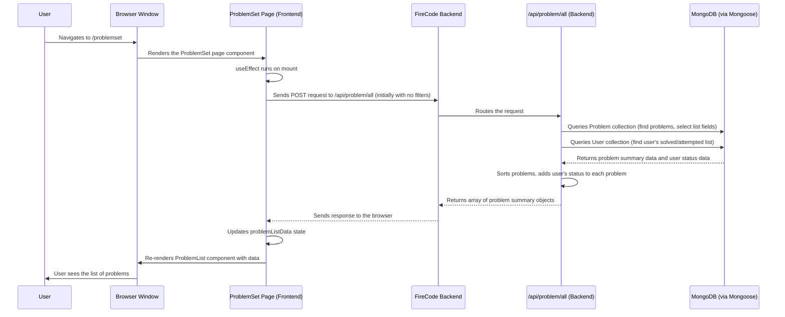
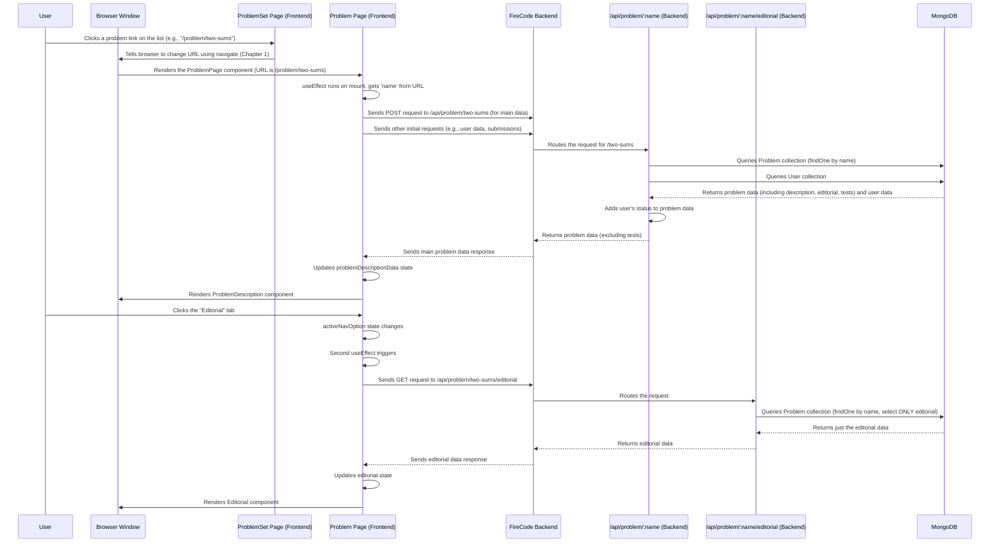

# Chapter 5: Problem Management

Welcome back, FireCoder! In the [previous chapter, Chapter 4: Code Execution and Submission](04_code_execution_and_submission_.md), we explored how FireCode takes your code, runs it, and tells you if you've solved a problem. But before you can *solve* a problem, you need to *find* and *understand* it!

Imagine FireCode is a massive library filled with challenging puzzles (the coding problems). You wouldn't just wander around hoping to stumble upon a puzzle. You'd go to the library's catalog to browse what's available, maybe search by topic or difficulty. Once you find a puzzle that interests you, you'd take out the book, read the instructions carefully, and look at any provided examples or hints.

**Problem Management** is exactly this part of FireCode. It's the system responsible for showing you the list of available problems (the library catalog) and providing all the details about a specific problem when you select it (the contents of the book, including the puzzle description and perhaps an explanation of the solution).

**What problem does this solve?**

Without a dedicated system for managing problems:
*   Users wouldn't be able to see what problems are available.
*   Each problem's description, example tests, and editorial would have to be manually embedded everywhere it's needed in the application code, making updates incredibly difficult.
*   Filtering, sorting, or searching through problems would be messy or impossible.

The "Problem Management" part of FireCode solves these issues by centralizing the storage and retrieval of all coding problem data. It provides structured ways to get lists of problems and fetch the complete details of any single problem, making it easy for the frontend to display this information consistently.

**Key Concepts**

This system revolves around a few core ideas:

1.  **Problem Data:** Each coding problem is a collection of information: a unique ID, name, difficulty, description, test cases, sometimes initial code, and an editorial (a step-by-step explanation of how to solve it).
2.  **Problem Listing:** The ability to fetch a list of available problems. This list usually includes summary information like name, difficulty, and acceptance rate, often allowing for filtering and sorting.
3.  **Problem Details:** The ability to fetch *all* the information for a single, specific problem, including the full description and potentially the editorial.
4.  **Data Provision:** Making sure this problem data is readily available to the frontend so it can be displayed to the user on pages like the problem list and individual problem pages.

**How FireCode Handles Problem Management**

Like User Authentication and Code Execution, Problem Management requires both the frontend and backend to work together.

**On the Frontend (Browsing and Viewing Problems):**

You interact with Problem Management primarily on two pages:

*   `/problemset` (ProblemSet page): This page displays the list of all available problems.
*   `/problem/:name` (ProblemPage): This page displays the details for a single problem, identified by its unique name in the URL (thanks to [Chapter 1: Frontend Pages and Navigation](01_frontend_pages_and_navigation_.md)'s dynamic routing).

These pages need to request problem data from the backend.

Let's look at the `ProblemSet.tsx` page, which shows the problem list:

```typescript
// src/pages/ProblemSet.tsx (Snippet)
// ... imports (useState, useEffect, axios, etc.) ...
import axios from "axios"; // To fetch data from the backend
import { API_URL } from "../App"; // Base URL for our backend API

const ProblemSet = ({ token, id }: { token: string | null; id: string | null; }) => {
    // ... state variables (username, problemListData, searchQ, etc.) ...
    const [problemListData, setProblemListData] = useState(); // State to hold the list of problems

    // Function to fetch problems, potentially with search/sort filters
    const handleSearch = async (
        searchQuery: string,
        options: SortOptions = { /* ... default sort options ... */ }
    ) => {
        // ... build query parameters from options ...
        try {
            // Use axios to send a POST request to the backend route for all problems
            const { data } = await axios.post(
                `${API_URL}/api/problem/all?search=${searchQuery}&acceptance=${/* ... */}&difficulty=${/* ... */}&title=${/* ... */}`,
                { id } // Include user ID, perhaps for solved/attempted status
            );
            setProblemListData(data); // Update the state with the fetched list
        } catch (error) {
            console.error("Error searching:", error);
        }
    };

    useEffect(() => {
        // When the component first loads, fetch the initial list of problems
        // This is called once due to the empty dependency array []
        handleSearch(""); // Fetch all problems initially (empty search query)
        // ... other initial data fetches (like user details) ...
    }, []); // Empty array means this effect runs only once after initial render

    return (
        <>
            {/* ... MainHeading and CustomNavbar ... */}
            <div>
                <input // Search input calls handleSearch on change
                    type="text"
                    placeholder="Search questions..."
                    onChange={(e) => {
                        handleSearch(e.target.value); // Call handleSearch with new input
                        setSearchQ(e.target.value); // Update search query state
                    }}
                    // ... other input props ...
                />
            </div>
            <div>
                {/* ProblemList component displays the data */}
                <ProblemList
                    searchFn={handleSearch} // Pass the fetch function down
                    searchQuery={searchQ}   // Pass the current search query
                    data={problemListData as any} // Pass the fetched problem data
                />
            </div>
            {/* ... rest of JSX ... */}
        </>
    );
};
// ... export ...
```
This code shows:
1.  A `useState` hook (`problemListData`) to store the array of problem objects received from the backend.
2.  An `useEffect` hook that runs once when the page loads, calling `handleSearch("")` to fetch the initial list of problems.
3.  A `handleSearch` function that constructs an API request (using `axios.post`) to the backend endpoint `/api/problem/all`. It includes search queries and sorting options as URL parameters.
4.  When the backend responds with the problem list data, `setProblemListData` is called to update the state, which in turn causes the `ProblemList` component to re-render with the new data.
5.  The `ProblemList` component ([Chapter 2: UI Components](02_ui_components_.md)) is responsible for taking this array of problem data and displaying it as a list on the screen.

Now let's look at the `ProblemPage.tsx` page, which fetches and displays a *single* problem's details:

```typescript
// src/pages/ProblemPage.tsx (Simplified Snippet)
// ... imports (useState, useEffect, axios, useParams, etc.) ...
import axios from "axios"; // To fetch data
import { useParams } from "react-router-dom"; // To get URL parameters (like problem name)
import { API_URL } from "../App";

const ProblemPage = ({ data: pageData, token, id }: { /* ... props types ... */ }) => {
    // ... state variables (code, isSubmitLoading, submissionData, etc.) ...
    const [problemDescriptionData, setProblemDescriptionData] =
        useState<DescriptionData>(); // State for problem description data
    const [editorial, setEditorial] = useState<string>(""); // State for editorial data

    const { name } = useParams(); // Get the dynamic part of the URL: the problem 'name'

    useEffect(() => {
        // Fetch the main problem data (description, initial code) when the page loads
        // Use the 'name' from the URL
        axios
            .post(`${API_URL}/api/problem/${name}`, { id: id }) // Request problem data by name
            .then(({ data }) => {
                setProblemDescriptionData(data.main); // Save the main problem data
                // Also set initial code if available
                if ("code_body" in data.main && "javascript" in data.main.code_body) {
                     setInitCode(data.main.code_body.javascript);
                }
            })
            .catch((e) => console.error(e));

        // ... fetch user data ...
        // ... fetch initial submission data ...

    }, []); // Empty array means this effect runs only once after initial render

    useEffect(() => {
        // This effect runs when the active navigation option changes (e.g., from Description to Editorial)
        if (pageData?.activeNavOption === "description") return; // No need to fetch if description

        // Fetch additional data like editorial based on the active tab
        axios
            .get(`${API_URL}/api/problem/${name}/${pageData?.activeNavOption}`) // Request specific section (like editorial)
            .then(({ data }) => {
                if (pageData?.activeNavOption === "editorial") {
                    if ("editorial_body" in data) {
                        setEditorial(data.editorial_body); // Save the editorial data
                    }
                }
            })
            .catch((e) => console.error(e));
    }, [pageData?.activeNavOption]); // This effect runs when activeNavOption changes

    // ... submitCode function ...

    return (
        <>
            {/* ... MainHeading ... */}
            <div>
                {/* ... ProblemNavbar (Description/Editorial/Submissions tabs) ... */}
                <div>
                    {/* Conditionally render components based on active tab and data */}
                    {problemDescriptionData != undefined && pageData?.activeNavOption === "description" ? (
                        <ProblemDescription data={problemDescriptionData} /> // Display description
                    ) : pageData?.activeNavOption === "description" ? (
                        <Loading For="pDescription" /> // Show loading for description
                    ) : (<></>)}

                    {pageData?.activeNavOption === "editorial" && editorial != "" ? (
                        <Editorial data={editorial} /> // Display editorial
                    ) : pageData?.activeNavOption === "editorial" ? (
                        <Loading For="pEditorial" /> // Show loading for editorial
                    ) : (<></>)}

                    {/* ... Submissions component ... */}
                </div>
            </div>
            {/* ... CodeMirror and Submit button ... */}
        </>
    );
};
// ... export ...
```
Here's what's happening:
1.  `useParams()` is used to grab the `name` from the URL path (e.g., if the URL is `/problem/two-sums`, `name` will be `"two-sums"`).
2.  The first `useEffect` hook runs once on page load, using `axios.post` to request the main problem data (`description_body`, `code_body`, etc.) from the backend endpoint `/api/problem/:name` (where `:name` is replaced by the actual problem name from the URL).
3.  When the data arrives, `setProblemDescriptionData` updates the state, causing the `ProblemDescription` component ([Chapter 2: UI Components](02_ui_components_.md)) to render the description.
4.  A second `useEffect` watches the `activeNavOption` prop (controlled by the tabs). If the user clicks the "Editorial" tab, this effect triggers, and `axios.get` is used to fetch the editorial data from a slightly different backend endpoint: `/api/problem/:name/editorial`.
5.  When the editorial data arrives, `setEditorial` updates the state, and the `Editorial` component ([Chapter 2: UI Components](02_ui_components_.md)) renders the editorial content.
6.  Loading components ([Chapter 2: UI Components](02_ui_components_.md)) are shown while waiting for the data.

**On the Backend (Storing and Serving Problem Data):**

The backend is where the actual problem data lives and where the requests from the frontend are handled.

1.  **Problem Blueprint:** The structure of each problem is defined using a Mongoose model ([Chapter 6: Data Persistence (MongoDB/Mongoose)](06_data_persistence__mongodb_mongoose__.md)).

    ```typescript
    // server/models/problem.ts (Snippet)
    import mongoose, { Document } from "mongoose";

    // Define what a Problem document looks like in the database
    export interface DProblem extends Document {
        main: ProblemData; // Main details like name, description, difficulty
        editorial: EditorialData; // The explanation of the solution
        test: any[][]; // The hidden test cases for evaluation
        function_name: string; // The name of the function the user needs to implement
    }

    // Define the Mongoose Schema
    const problemSchema = new mongoose.Schema<DProblem>({
        main: { /* ... schema for main problem data fields ... */ },
        editorial: { editorial_body: String }, // Just the editorial text
        test: Array,
        function_name: String,
    });

    // Create the Mongoose Model
    const ProblemModel = mongoose.model<DProblem>("Problem", problemSchema);

    export default ProblemModel;
    ```
    This `ProblemModel` defines the fields for each problem stored in the database. It clearly separates the `main` problem data, the `editorial`, and the `test` cases.

2.  **Handling Requests (API Routes):** The `server/routes/problem.ts` file contains the API endpoints ([Chapter 8: API Routing](08_api_routing_.md)) that the frontend calls.

    ```typescript
    // server/routes/problem.ts (Snippet - Get all problems)
    import express from "express";
    import ProblemModel from "../models/problem"; // Our Problem blueprint
    // ... other imports ...

    const problem = express.Router();

    // Route to get a list of all problems (with optional search/filter/sort)
    problem.post("/all", async (req, res) => {
        // ... get search, difficulty, acceptance, title from req.query ...
        // ... get user id from req.body ...

        try {
            // 1. Query the database to find problems
            // Find documents where the name matches the search term (case-insensitive regex)
            // Only select specific fields (projection) to keep the list response small
            const allProblems = await ProblemModel.find(
                { "main.name": { $regex: search, $options: "i" } },
                "main.id main.name main.acceptance_rate_count main.difficulty main.like_count main.dislike_count"
            )
            .sort({ "main.id": 1 }) // Sort by ID initially
            .exec(); // Execute the query

            // 2. Apply sorting based on query parameters
            // Use helper functions to sort the fetched problems
            const allProblemsSorted = sortByAcceptance(
                acceptance.toString() as Sort,
                sortByDifficulty(
                    difficulty.toString() as Sort,
                    sortByTitle(title.toString() as Sort, allProblems)
                )
            );

            // 3. Fetch user data to mark solved/attempted problems
            const user = await UserModel.findById(id);
            // ... check user's solved/attempted lists and add 'status' field to problem objects ...

            // 4. Send the sorted list of problems back to the frontend
            res.json(allProblemsArray); // allProblemsArray now includes status
        } catch (e) {
            console.log(e);
            res.json({ success: false, message: "Internal Server Error" });
        }
    });
    // ... other problem routes ...
    export default problem;
    ```
    This handler for `/api/problem/all`:
    *   Receives search and sorting parameters from `req.query` and the user ID from `req.body`.
    *   Uses `ProblemModel.find` to query the database, filtering by search term and selecting only the necessary fields for the list view (`"main.id main.name ..."`) – this is important for performance!
    *   Applies sorting logic using helper functions.
    *   Fetches the user's data to figure out which problems they have solved or attempted and adds a `status` field to the problem objects before sending them back.

    Now, the route for fetching a *single* problem's main details:

    ```typescript
    // server/routes/problem.ts (Snippet - Get single problem details)
    // ... imports ...
    const problem = express.Router();
    // ... /all route ...

    // Route to get details for a specific problem by name
    problem.post("/:name", async (req, res) => {
        const { name } = req.params; // Get the problem name from the URL parameter
        const { id } = req.body; // Get the user ID

        try {
            // 1. Find the specific problem by its name
            const problem = await ProblemModel.findOne({ "main.name": name });

            // 2. Fetch user data to potentially mark status
            const user = await UserModel.findById(id);
            const problemJson: DProblem = JSON.parse(JSON.stringify(problem));

            // 3. Add status (solved/attempted) if user is logged in
            if (user?.problems_attempted.includes(name)) {
                problemJson.main.status = "attempted";
            }
            if (user?.problems_solved.includes(name)) {
                problemJson.main.status = "solved";
            }

            // 4. Send the full problem data back (excluding tests for the frontend)
            if (problemJson) {
                res.json(problemJson); // Send the problem data
            } else {
                res.json({ error: "problem not found" }); // Or an error if not found
            }
        } catch (e) {
            console.log(e);
            res.json({ success: false, message: "Internal Server Error" }); // Handle server errors
        }
    });
    // ... other problem routes (/submit, /submissions, /:name/editorial) ...
    export default problem;
    ```
    This handler for `/api/problem/:name`:
    *   Gets the problem `name` from `req.params`.
    *   Uses `ProblemModel.findOne` to find just one document that matches the name.
    *   Fetches user data and adds the `status` field similar to the `/all` route.
    *   Sends the found problem document (which includes `main` data and `editorial` data, but the frontend only uses `main` from this route) back to the frontend. The `test` field is typically *not* sent to the frontend for security reasons, as it would reveal the hidden test cases.

    Finally, the route for just the editorial:

    ```typescript
    // server/routes/problem.ts (Snippet - Get editorial)
    // ... imports ...
    const problem = express.Router();
    // ... /all and /:name routes ...

    // Route to get just the editorial for a specific problem
    problem.get("/:name/editorial", async (req, res) => {
        const name = req.params.name; // Get problem name

        try {
            // Find the problem and select *only* the editorial field
            const problem = await ProblemModel.findOne(
                { "main.name": name },
                "editorial" // Projection: only get the editorial field
            );
            if (problem) {
                res.json(problem.editorial); // Send only the editorial data
            } else {
                res.json({ error: "editorial not found" });
            }
        } catch (e) {
            console.log(e);
            res.json({ success: false, message: "Internal Server Error" });
        }
    });
    // ... /submit and /submissions routes ...
    export default problem;
    ```
    This handler for `/api/problem/:name/editorial`:
    *   Gets the problem `name` from `req.params`.
    *   Uses `ProblemModel.findOne` again, but crucially, the second argument `"editorial"` is a "projection" – it tells Mongoose to *only* fetch the `editorial` field from the database, making the response smaller and more efficient.
    *   Sends just the `editorial` object back to the frontend.

**How it Works Under the Hood (Simplified Flow)**

Let's trace the journey of getting the problem list and then viewing a single problem:

**Getting the Problem List (`/problemset`):**



**Viewing a Single Problem (`/problem/:name`):**



1.  When you visit the `/problemset` page, the frontend `ProblemSet` component makes an API call to `/api/problem/all`.
2.  The backend receives this request, queries the database for problem summary data, potentially filters/sorts it, adds user status, and sends the resulting list back.
3.  The frontend receives the list and uses the `ProblemList` component to display it.
4.  When you click a specific problem link (e.g., `/problem/two-sums`), the frontend navigates to that URL ([Chapter 1](01_frontend_pages_and_navigation_.md)).
5.  The `ProblemPage` component for that URL runs, gets the problem name (`two-sums`) from the URL, and makes API calls to `/api/problem/two-sums` (for the main description) and potentially `/api/problem/two-sums/editorial` (when you click the editorial tab).
6.  The backend receives these requests, finds the specific problem in the database (fetching different subsets of data depending on the endpoint), and sends the requested information back.
7.  The frontend receives the detailed data and uses components like `ProblemDescription` and `Editorial` to render it beautifully on the page.

This efficient back-and-forth between frontend and backend, powered by dedicated API routes and a structured database model, is how FireCode manages and presents its library of coding challenges.

**Conclusion**

In this chapter, we uncovered the system responsible for **Problem Management** in FireCode. We learned how it acts like a library catalog and detailed book, allowing users to browse a list of problems and fetch the full details (description and editorial) for any selected problem. We saw how the frontend pages (`ProblemSet` and `ProblemPage`) request this data from the backend and how the backend uses API routes and a database model to retrieve and serve the problem information.

Understanding how problem data is organized and accessed is crucial for building features like searching, sorting, and displaying problems effectively.

Now that we know how problems are managed and retrieved, let's take a closer look at *where* this problem data (and other data like user accounts and submissions) is actually stored permanently.

Let's move on to [Chapter 6: Data Persistence (MongoDB/Mongoose)](06_data_persistence__mongodb_mongoose__.md)!

---

Generated by [AI Codebase Knowledge Builder](https://github.com/The-Pocket/Tutorial-Codebase-Knowledge)