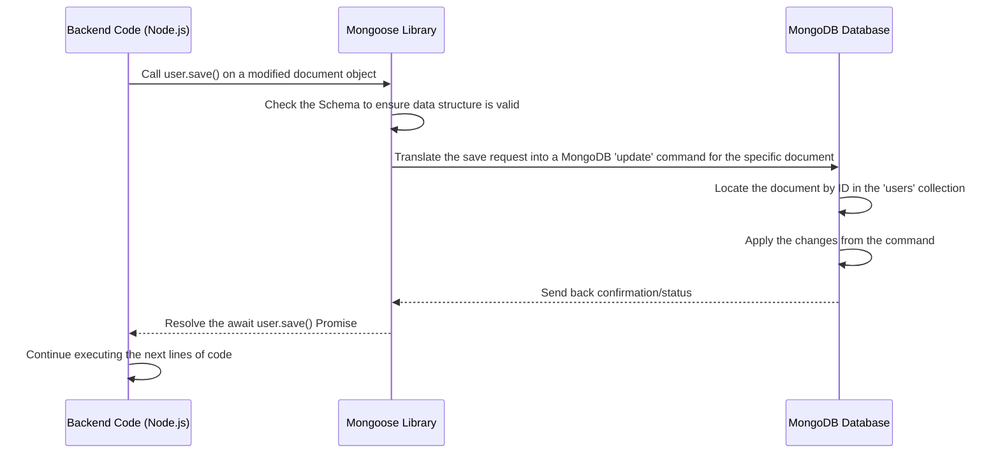

# Chapter 6: Data Persistence (MongoDB/Mongoose)

Welcome back to the FireCode tutorial! In the [previous chapter, Chapter 5: Problem Management](05_problem_management_.md), we learned how FireCode organizes, lists, and displays the details of coding problems, acting like a library catalog and the books themselves. But where does all this problem data – the descriptions, tests, and editorials – actually *live* when the server isn't actively sending it to your browser? Where are your user accounts, your solved problem lists, and your submission history kept safe?

Imagine our FireCode library again. The catalog and the books are great, but what about the filing system that keeps track of every book, every library card, and every borrowing record permanently? If there wasn't a reliable place to store this information, the library would forget who you are, which books exist, and which ones you've borrowed every time it closed for the night!

**Data Persistence** is this reliable filing system. It's about storing all the crucial information that makes FireCode work in a way that it survives even if the server restarts or loses power. This data needs to be saved, organized, and easily retrieved whenever the application needs it – whether it's fetching a problem description, checking a user's login, or listing past submissions.

**What problem does this solve?**

Without data persistence, your FireCode experience would be very frustrating:
*   You'd have to sign up every time you visited the site.
*   The list of problems would be empty because the application forgot they exist.
*   Your submission history would vanish after you close the page.
*   Any problems you marked as solved wouldn't be remembered.

Data Persistence solves this by providing a permanent home for all this important information using a **database**.

**Key Concepts**

This part of FireCode involves a few core ideas:

1.  **Database (MongoDB):** This is the central storage facility. Think of it as a giant digital warehouse designed specifically for storing and managing large amounts of structured (and sometimes unstructured) data. FireCode uses **MongoDB**, a type of database that stores data in flexible, document-like formats (similar to JSON), rather than strict tables like traditional databases. It's good for handling data that might have slight variations from one item to the next.

    *   **Analogy:** The entire physical library building itself – a place designed to hold countless books and records safely. MongoDB is a warehouse for digital documents.

2.  **Data Modeling (Schemas):** Even though MongoDB is flexible, it's still important to define the expected structure for our data. How should a "User" document look? What fields should a "Problem" document have? We use **Schemas** to describe these structures. This helps keep our data organized and ensures that when we try to save or read data, we know what to expect.

    *   **Analogy:** The Dewey Decimal System or categories like "Fiction," "Science," "History." It's a system for organizing the books and records so you can find them later. Schemas are blueprints for our digital documents.

3.  **Object-Document Mapper (Mongoose):** This is the tool that helps our JavaScript code (running on the backend server) talk to the MongoDB database easily. Mongoose acts like a translator and an assistant:
    *   It translates JavaScript objects (like a user object in our code) into the document format MongoDB understands, and vice-versa.
    *   It helps enforce our defined Schemas, ensuring we don't accidentally save data that's missing important fields.
    *   It provides easy-to-use methods (like `find`, `findOne`, `save`, `delete`) for performing common database operations (reading, writing, updating, deleting).

    *   **Analogy:** The librarian or library catalog system. You don't talk directly to the warehouse shelves (MongoDB); you ask the librarian (Mongoose) using library terms (Mongoose methods like `find`) to get you the book you need (data document). The librarian uses the filing system (Schema) to help.

**How FireCode Uses Data Persistence**

Data Persistence is primarily a **backend** concept, as the database lives on the server side. The frontend applications (like your browser) don't usually talk directly to the database; they talk to the backend server via API calls, and the backend server then talks to the database using Mongoose.

Let's look at how the backend connects to MongoDB and defines the structure for our data using Mongoose, and then how it uses Mongoose to perform basic database operations.

**1. Connecting to the Database**

The very first thing the backend needs to do is establish a connection to the MongoDB server. This happens when the FireCode backend server starts up.

```typescript
// server/server.ts (Snippet)
require("dotenv").config(); // Loads environment variables (like the database connection string)
import mongoose from "mongoose"; // Import Mongoose

const MONGODB_URI = process.env.MONGODB_URI || ""; // Get the database URL from environment variables

// Connect to the MongoDB database
mongoose.connect(MONGODB_URI);

export const db = mongoose.connection; // Get the connection object

// Set up listeners for connection events (optional but good practice)
db.on("error", console.error.bind(console, "MongoDB connection error:"));
db.once("open", () => {
    console.log("Connected to MongoDB"); // Log success when connected
});

// ... rest of server setup (express app, middleware, routes) ...
```
This code snippet from `server/server.ts` is fundamental. It imports the `mongoose` library and calls `mongoose.connect()`, passing the URL of the MongoDB database (stored securely in an environment variable `MONGODB_URI`). This line attempts to connect the backend application to the database. The `db.on('error')` and `db.once('open')` lines just set up simple messages to let us know if the connection failed or succeeded.

**2. Defining Data Structures (Schemas and Models)**

Before we can save or retrieve data, we need to tell Mongoose what our data should look like. This is done using Mongoose Schemas and Models.

Here's the simplified structure for a User document, as seen in [Chapter 3: User Authentication and Accounts](03_user_authentication_and_accounts_.md):

```typescript
// server/models/user.ts (Snippet)
import mongoose, { Document } from "mongoose"; // Import Mongoose types

// 1. Define the TypeScript Interface: Describes what a User document should contain
interface DUser extends Document {
    username: string;
    email: string;
    password: string; // Stored securely hashed, as seen in Chapter 3!
    submissions: Submission[] | undefined; // Array of submission objects (from Chapter 4/Problem Types)
    problems_starred: string[];
    problems_solved: string[];
    // ... other fields like counts, rank, etc. ...
}

// 2. Define the Mongoose Schema: Tells Mongoose the structure and types
const userSchema = new mongoose.Schema<DUser>({
    username: { type: String, required: true }, // String type, must have this field
    email: { type: String, required: true },     // String type, must have this field
    password: { type: String, required: true }, // String type, must have this field
    submissions: Array, // Can be an array of any type (though we expect Submission objects)
    problems_starred: Array, // Array of strings (problem names/IDs)
    problems_solved: Array,  // Array of strings (problem names/IDs)
    // ... other fields with their types and options (like default values) ...
});

// 3. Create the Mongoose Model: This is the class we'll use to interact with the 'users' collection
const UserModel = mongoose.model<DUser>("User", userSchema);

export default UserModel; // Export the model so other files can use it
```
*   We first define a TypeScript `interface` (`DUser`) to help us developers understand the structure and types.
*   Then, we create a `mongoose.Schema` (`userSchema`). This is where we tell Mongoose the specific types for each field (`String`, `Array`, `Number`, etc.) and add validation rules (like `required: true` meaning the field *must* be present when saving a new user).
*   Finally, `mongoose.model()` creates the `UserModel`. This is the main tool we'll use in our code to query the database's "users" collection (Mongoose automatically pluralizes the name "User" to "users").

Similarly, we define the structure for Problem documents:

```typescript
// server/models/problem.ts (Snippet)
import mongoose, { Document } from "mongoose";

// 1. Define the TypeScript Interface
export interface DProblem extends Document {
    main: ProblemData;      // Object containing main problem details
    editorial: EditorialData; // Object containing editorial text
    test: any[][];          // Array of arrays for test cases
    function_name: string;  // String for the expected function name
    // ... (interfaces for ProblemData and EditorialData would be defined elsewhere or inline) ...
}

// 2. Define the Mongoose Schema
const problemSchema = new mongoose.Schema<DProblem>({
    main: { // Nested object schema
        id: Number,
        name: String,
        difficulty: String,
        // ... other main fields ...
    },
    editorial: { editorial_body: String }, // Nested object with one field
    test: Array,
    function_name: String,
});

// 3. Create the Mongoose Model
const ProblemModel = mongoose.model<DProblem>("Problem", problemSchema);

export default ProblemModel; // Export the model
```
This creates the `ProblemModel` which allows us to interact with the "problems" collection in the database, following the structure defined by `problemSchema`.

**3. Performing Database Operations (CRUD)**

With the connection established and models defined, our backend code can now perform actions on the data. Mongoose provides methods on the Models (like `UserModel`, `ProblemModel`) to do this. Let's see examples of creating, reading, updating, and deleting data, tying back to concepts from previous chapters.

**Creating Data (Saving a New User Account - from Chapter 3)**

When a new user signs up, we create a new User document and save it.

```typescript
// server/routes/accounts.ts (Snippet - Signup route)
// ... imports (UserModel, bcrypt, etc.) ...

accounts.post("/signup", async (req, res) => {
    try {
        const { username, email, password } = req.body; // Data from frontend

        // ... validation and password hashing (as seen in Chapter 3) ...
        const hashedPas = await bcrypt.hash(password, 10);

        // Create a new instance of the UserModel
        const newUser = new UserModel({
            username: username,
            email: email,
            password: hashedPas, // Store the hashed password
            // Mongoose automatically adds default values if defined in schema or model
        });

        // Save the new document to the database!
        await newUser.save(); // <-- This is the database write operation

        // ... generate token and send response (as seen in Chapter 3) ...
        res.status(201).json({ success: true, message: "Account created" });

    } catch (e) {
        // ... error handling ...
    }
});
```
Here, `new UserModel({...})` creates a new object in memory that matches our `userSchema`. Calling `.save()` on this object tells Mongoose to insert this data as a new document into the "users" collection in MongoDB. The `await` keyword is used because saving to the database takes time, and we want our code to wait until it's finished before moving on.

**Reading Data (Fetching Problems - from Chapter 5)**

To show the problem list or a single problem, we read documents from the "problems" collection.

```typescript
// server/routes/problem.ts (Snippet - Get all problems route)
// ... imports (ProblemModel, etc.) ...

problem.post("/all", async (req, res) => {
    // ... get search/sort parameters ...

    try {
        // Find multiple documents in the 'problems' collection
        const allProblems = await ProblemModel.find(
            { "main.name": { $regex: search, $options: "i" } }, // Filter criteria
            "main.id main.name main.difficulty ..." // Projection (select specific fields)
        )
        .sort({ "main.id": 1 }) // Sort criteria
        .exec(); // Execute the query

        // ... process and send the list ...
        res.json(allProblems);
    } catch (e) {
        // ... error handling ...
    }
});

// server/routes/problem.ts (Snippet - Get single problem route)
// ... imports (ProblemModel, etc.) ...

problem.post("/:name", async (req, res) => {
    const { name } = req.params; // Problem name from URL

    try {
        // Find ONE document in the 'problems' collection by name
        const problem = await ProblemModel.findOne({ "main.name": name }); // Filter criteria

        // ... process and send the problem data ...
        if (problem) {
            res.json(problem); // problem is a Mongoose document object
        } else {
             res.json({ error: "problem not found" });
        }

    } catch (e) {
        // ... error handling ...
    }
});
```
*   `ProblemModel.find({...}, "...")` finds *all* documents in the collection that match the filter criteria (the first argument, `{ "main.name": { $regex: search, ... } }`). The second argument specifies which fields to include in the result (a "projection"). We can then chain methods like `.sort()` and `.exec()` to further refine the query.
*   `ProblemModel.findOne({...})` is similar but only retrieves the *first* document that matches the criteria. It's used when we expect zero or one result, like finding a problem by its unique name.

Both `find` and `findOne` methods read data from the database and return Mongoose Document objects (or an array of them for `find`).

**Updating Data (Saving a User's Submission - tying back to Chapter 4)**

When a user submits code, we need to add that submission record to their existing User document.

```typescript
// server/routes/problem.ts (Snippet - Submit route)
// ... imports (UserModel, ProblemModel, etc.) ...

problem.post("/submit/:name", async (req, res) => {
    const { name } = req.params;
    const { id, code, problem_name } = req.body;

    try {
        // 1. Find the existing User document by ID
        const user = await UserModel.findById(id); // Read operation

        if (!user) { /* ... handle user not found ... */ return; }

        // ... execute code and get submissionResult (as seen in Chapter 4) ...
        const executionResult = { /* ... result object ... */ }; // Dummy result

        // 2. Create the new submission object
        let newSubmission = {
             problem_name: problem_name,
             status: executionResult.stdout.status,
             // ... other submission details from executionResult ...
             time: new Date(),
             code_body: code,
             // ... input/output for Wrong Answer ...
        };

        // 3. Modify the user document object in memory
        // Add the new submission to the beginning of the submissions array
        user.submissions = [newSubmission, ...(user.submissions || [])];

        // 4. Update user stats if problem is solved
        if (newSubmission.status === "Accepted") {
            if (!user.problems_solved.includes(problem_name)) {
                user.problems_solved.push(problem_name);
                user.problems_solved_count = (user.problems_solved_count || 0) + 1;
            }
        } else {
            if (!user.problems_attempted.includes(problem_name)) {
                 user.problems_attempted.push(problem_name);
             }
        }


        // 5. Save the MODIFIED document back to the database!
        await user.save(); // <-- This is the database update operation

        // ... send back submission results ...
        const subsByName = user.submissions.filter(elem => elem.problem_name === problem_name);
        res.json(subsByName);

    } catch (e) {
        // ... error handling ...
    }
});
```
In this example:
1.  We first `await UserModel.findById(id)` to read the specific user's document from the database into our code's memory.
2.  We then treat `user` as a regular JavaScript object and modify its properties (specifically, adding the `newSubmission` to the `user.submissions` array and updating solved/attempted lists).
3.  Finally, `await user.save()` is called on the modified `user` object. Mongoose recognizes that this is an *existing* document and updates the corresponding record in the database with the new data we've put into the `user` object. This is how we "persist" the change (the new submission).

**Deleting Data (Deleting a User Account - from Chapter 3)**

If a user decides to delete their account, we remove their document from the database.

```typescript
// server/routes/accounts.ts (Snippet - Delete account route)
// ... imports (UserModel, authenticateToken - Chapter 7) ...

// Note: authenticateToken middleware ensures only a logged-in user can hit this route
accounts.post("/delete/:id", authenticateToken, async (req, res) => {
    const { id } = req.params; // User ID from the URL

    try {
        // Find ONE document by ID and remove it from the 'users' collection
        await UserModel.findByIdAndDelete(id); // <-- This is the database delete operation

        res.json({ success: true, message: "Account deleted successfully" });
    } catch (e) {
        // ... error handling ...
    }
});
```
`UserModel.findByIdAndDelete(id)` is a convenient Mongoose method that combines finding a document by its unique `_id` (automatically generated by MongoDB) and deleting it from the collection in one step. Like `save`, it's an asynchronous operation, so we `await` it.

**How it Works Under the Hood (Simplified)**

Let's trace the flow of a backend operation that needs to interact with the database, like saving that new submission we just discussed.



1.  Our backend code has a Mongoose Document object (`user`) that we've modified (e.g., added a submission to its `submissions` array).
2.  We call `await user.save()`. This tells Mongoose we want to persist these changes.
3.  Mongoose looks at the data in the `user` object and compares it to the `userSchema` blueprint to ensure it's valid.
4.  Mongoose translates the request to save this modified object into a specific command that MongoDB understands (like an `updateOne` command targeting the document with that user's `_id`).
5.  Mongoose sends this command over the network to the MongoDB database server.
6.  MongoDB receives the command, finds the correct document in its collection using the `_id`, applies the requested changes, and updates the document on disk.
7.  MongoDB sends back a confirmation to Mongoose indicating whether the operation was successful.
8.  Mongoose receives the confirmation and resolves the `Promise` that `user.save()` returned, allowing our backend code (which was waiting with `await`) to continue.

Reading data follows a similar path, but Mongoose translates `find` or `findOne` calls into MongoDB `find` commands, and when MongoDB returns the data, Mongoose translates the MongoDB document format back into a Mongoose Document object that our JavaScript code can easily work with.

**Conclusion**

In this chapter, we learned about **Data Persistence** and how FireCode uses **MongoDB** as its database and **Mongoose** as the tool to interact with it. We saw how `mongoose.connect` establishes the link to the database, how Schemas and Models (`UserModel`, `ProblemModel`) provide blueprints for our data, and how Mongoose methods like `save`, `find`, `findOne`, and `findByIdAndDelete` are used by the backend code to perform the essential database operations of creating, reading, updating, and deleting data. This robust system ensures that all of FireCode's important information is stored safely and can be accessed reliably.

Now that we understand how data is stored and accessed, let's look at how the backend intercepts requests and performs actions *before* or *after* the main request handling logic.

Let's move on to [Chapter 7: Middleware](07_middleware_.md)!

---

Generated by [AI Codebase Knowledge Builder](https://github.com/The-Pocket/Tutorial-Codebase-Knowledge)