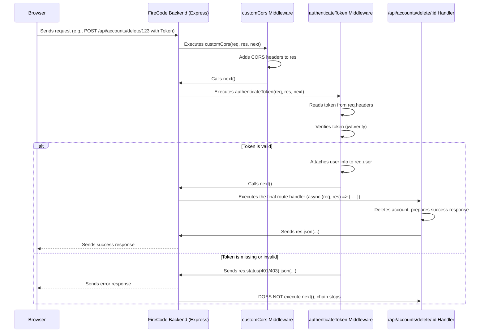

# Chapter 7: Middleware

Welcome back to the FireCode tutorial! In the [previous chapter, Chapter 6: Data Persistence (MongoDB/Mongoose)](06_data_persistence__mongodb_mongoose__.md), we explored how FireCode stores all its important information – problem details, user accounts, submission history – safely in a database using MongoDB and Mongoose. We learned how the backend code talks to the database to save and retrieve this data.

Now, let's think about what happens the moment a request arrives at the backend server, *before* it even gets to the specific code that will, for example, save a user to the database or fetch problems from it. How can we perform common checks or preparations that apply to many, or even all, incoming requests?

Imagine each incoming request to the FireCode backend is like a package arriving at a sorting facility. Before the package reaches its final delivery truck (the specific piece of code that handles that type of request, like saving a user or running code), it might need to go through several steps: scanning for safety, checking customs declarations, perhaps adding a tracking sticker.

**Middleware** are like these processing steps or checkpoints. They are functions that stand in line, ready to inspect, modify, or process the incoming request (or the outgoing response) before it moves along the chain. Every request might pass through one or more middleware functions before it reaches the final destination handler that does the main work (like interacting with the database or running code).

**What Problem Does This Solve?**

Without middleware, you would have to repeat the same code in *many* different places. For example:

*   How do you check if a user is logged in and has permission to access a specific feature (like deleting their account) *before* running the delete logic? You'd have to write the token checking code in every single route handler that needs protection.
*   How do you allow your frontend code (running on `localhost:3000`) to communicate with your backend API (running on `localhost:80`) without the browser blocking the request (due to something called CORS - Cross-Origin Resource Sharing)? You'd have to add special headers to the response in every single route handler.

Middleware solves this by letting you write these common tasks *once* as a middleware function and then apply that function to whichever requests need it. It's a way to insert logic into the request-response pipeline in a clean, reusable way.

**Key Concepts**

Middleware in the context of web frameworks like Express (used by FireCode's backend) has a few key characteristics:

1.  **Functions in a Chain:** Middleware functions are just JavaScript functions. They are typically arranged in a sequence, and each incoming request travels through this sequence, one function at a time.
2.  **Access to Request and Response:** A middleware function always receives the incoming request object (`req`) and the outgoing response object (`res`) as arguments. This allows them to read information from the request (like headers, body, URL), modify the response (like adding headers or setting status codes), or even end the request-response cycle by sending a response.
3.  **The `next()` Function:** Middleware functions receive a third argument, typically named `next`. If the middleware function completes its task and the request should continue down the chain to the next middleware or the final route handler, the middleware *must* call `next()`. If the middleware handles the request completely (e.g., sends an error response because a token is missing) and no further processing is needed, it should *not* call `next()`.

**How FireCode Uses Middleware**

FireCode uses middleware for crucial tasks like handling CORS and authenticating users. Let's look at simplified versions of these middleware functions and how they are applied.

**Use Case 1: Allowing Communication from the Frontend (CORS Middleware)**

When your frontend (running in your browser) makes a request to your backend server, the browser enforces security rules. By default, a webpage loaded from `localhost:3000` cannot make requests to a server at `localhost:80` unless the server explicitly allows it. This is where **CORS (Cross-Origin Resource Sharing)** comes in.

FireCode uses a custom middleware (`customCors`) to handle this:

```typescript
// server/middlewares/cors.ts (Simplified)
import { NextFunction } from "express";
import express from "express";

export function customCors( // This is our middleware function
    req: express.Request,    // The incoming request
    res: express.Response,   // The outgoing response
    next: NextFunction       // Function to call the next middleware/handler
) {
    // Add headers to the response to tell the browser it's okay to receive this response
    res.setHeader("Access-Control-Allow-Origin", "*"); // Allows requests from *any* origin (for development simplicity)
    res.setHeader(
        "Access-Control-Allow-Headers",
        "Access-Control-Allow-Headers, content-type, Origin,Accept, X-Requested-With, Content-Type, Access-Control-Request-Method, Access-Control-Request-Headers, Authorization" // Allows specific headers
    );
    res.setHeader("Access-Control-Allow-Methods", "GET, POST, PUT, PATCH, OPTIONS, DELETE"); // Allows specific HTTP methods

    // Browsers often send an "OPTIONS" request first to check CORS rules
    if (req.method === "OPTIONS") {
        // If it's an OPTIONS request, just send a success response and STOP the chain
        return res.status(200).json({ body: "OK", });
    }

    // If it's not an OPTIONS request, the middleware did its job (added headers)
    // Call next() to pass control to the next middleware or the final route handler
    next();
}
```
This middleware function simply adds several `Access-Control-...` headers to the `res` object for every incoming request. These headers instruct the user's browser that it's safe to allow communication between the frontend and this backend server, even if they are hosted on different origins (like different ports on your machine).

For the special `OPTIONS` requests that browsers sometimes send before the real request, this middleware sends an immediate `res.status(200).json(...)` response and *doesn't* call `next()`, effectively ending the request-response cycle here because the browser only needed the header information.

This middleware is applied early in the request processing pipeline using `app.use()` in `server/server.ts`:

```typescript
// server/server.ts (Snippet)
import express from "express";
import { customCors } from "./middlewares/cors"; // Import the customCors middleware

const app: express.Application = express();
// ... database connection setup ...

// Use the customCors middleware for ALMOST ALL incoming requests
app.use(customCors);

// ... other middleware like express.json() ...

// ... API routes ...

app.listen(/* ... */);
```
Using `app.use(customCors)` means that *any* request hitting this Express application will pass through the `customCors` function first. It's a simple and effective way to apply this necessary CORS logic universally.

**Use Case 2: Protecting Routes (Authentication Middleware)**

As seen in [Chapter 3: User Authentication and Accounts](03_user_authentication_and_accounts_.md), certain actions (like deleting an account or viewing private user data) should only be allowed if the user is logged in and their identity is verified via a token. Middleware is the perfect tool for this.

FireCode uses the `authenticateToken` middleware for this purpose:

```typescript
// server/middlewares/token.ts (Simplified)
import { NextFunction } from "express";
import express from "express";
import jwt from "jsonwebtoken"; // Used to verify the token

// Define a custom Request type to add user info later
interface UserRequest extends express.Request {
    user?: string; // We'll add the decoded username here
}

export function authenticateToken( // Our authentication middleware
    req: UserRequest,              // Request object (using our custom type)
    res: express.Response,         // Response object
    next: NextFunction             // Function to call next
) {
    // 1. Get the token from the request headers (usually Authorization)
    const authHeader = req.headers["authorization"];
    const token = authHeader; // Assuming token is directly the header value

    if (!token) {
        // 2. If no token exists, send a 401 Unauthorized response and STOP the chain
        return res.status(401).json({ success: false, message: "Token not provided" });
    }

    // 3. Verify the token using the secret key the server knows
    // jwt.verify decrypts the token and checks if it's valid and not expired
    jwt.verify(token, process.env.ACCESS_TOKEN_SECRET!, (err, decoded) => {
        if (err) {
            // 4. If verification fails, send a 403 Forbidden response and STOP the chain
            return res.status(403).json({ success: false, message: "Invalid token" });
        }
        // 5. If verification succeeds, the 'decoded' object contains the info originally put in the token (like the username)
        // Attach the decoded user info to the request object for later use by route handlers
        req.user = decoded?.toString();

        // 6. Call next() to allow the request to proceed to the next middleware or the final route handler
        next();
    });
}
```
This `authenticateToken` middleware does the heavy lifting of checking if an incoming request has a valid JWT token. It looks for the token in the request headers, uses `jwt.verify` to check its authenticity, and if everything is okay, it adds the user's information (obtained from the token) to the request object (`req.user`). If the token is missing or invalid, it immediately sends an appropriate error response (`401` or `403`) and stops the request chain by *not* calling `next()`.

This middleware is *not* applied to all requests. It's only applied to the specific routes that require a logged-in user. We saw examples of this in [Chapter 3: User Authentication and Accounts](03_user_authentication_and_accounts_.md):

```typescript
// server/routes/accounts.ts (Snippet showing middleware usage)
import express from "express";
// ... other imports ...
import { authenticateToken } from "../middlewares/token"; // Import the middleware

const accounts = express.Router();

// ... /signup and /login routes (do NOT use authenticateToken) ...

// This route requires a valid token before its logic runs
accounts.post("/delete/:id", authenticateToken, async (req, res) => {
    // If the code execution reaches this point, authenticateToken ran successfully!
    try {
        const { id } = req.params;
        // We can now safely proceed with deleting the account associated with the user whose token was verified
        // In a real app, you'd also check if req.user matches the id being deleted for security
        // await UserModel.findByIdAndDelete(id); // Database operation (Chapter 6)
        res.json({ success: true, message: "Account deleted successfully" });
    } catch (e) {
        // ... error handling ...
    }
});

// This route also requires a valid token
accounts.get("/id/:id", authenticateToken, async (req, res) => {
    // Again, token verified by authenticateToken
    const id = req.params.id;
    // Fetch user by ID (Chapter 6) and return their data
    // res.json(user);
});

// This route DOES NOT require a token (public profile view)
accounts.get("/:name", async (req, res) => {
    const name = req.params.name;
    // Fetch public user data by username (Chapter 6)
    // res.json(publicUser);
});

export default accounts;
```
When defining a route using Express (`accounts.post`, `accounts.get`, etc.), you can pass one or more middleware functions as arguments *before* the final route handler function (`async (req, res) => { ... }`). Express will execute these middleware functions in order. If any middleware calls `next()`, the next function (middleware or the final handler) is executed. If a middleware sends a response and *doesn't* call `next()`, the chain stops, and the final route handler for `/delete/:id` is never reached.

**How it Works Under the Hood (Simplified Middleware Chain)**

Think of Express on the backend as having a list of functions to run for each incoming request. When a request arrives, Express starts walking through this list.



1.  An incoming request arrives at the backend server (`POST /api/accounts/delete/123`).
2.  Express starts processing the request. It first runs middleware applied with `app.use()`, like `customCors`.
3.  `customCors` adds necessary headers to the response and calls `next()`.
4.  Express moves to the next piece of middleware or the route definition. Since the request path is `/api/accounts/delete/123`, Express finds the matching route definition `accounts.post("/delete/:id", authenticateToken, async (req, res) => { ... })`.
5.  Express sees that `authenticateToken` is listed before the final handler, so it executes `authenticateToken(req, res, next)`.
6.  `authenticateToken` checks for the token.
7.  *If the token is missing or invalid:* `authenticateToken` sends an error response (`res.status(...)`) and does *not* call `next()`. The request processing stops, and the final route handler `async (req, res) => { ... }` for deleting the account is *never* called. An error is sent back to the browser.
8.  *If the token is valid:* `authenticateToken` attaches the decoded user info to `req` and calls `next()`. Express then proceeds to the *next* function in the list for this route, which is the final route handler `async (req, res) => { ... }`.
9.  The final route handler executes its logic (like deleting the user from the database, referencing [Chapter 6: Data Persistence](06_data_persistence__mongodb_mongoose__.md)) and sends the final response to the browser.

This chaining mechanism allows middleware to act as layers of processing or security that requests must pass through.

**Conclusion**

In this chapter, we learned about **Middleware** – functions that sit in the request-response pipeline on the backend, acting as checkpoints or processing stations. We saw how they solve the problem of repetitive code by handling cross-cutting tasks like allowing communication from the frontend (CORS) using `customCors` and protecting routes by verifying user tokens using `authenticateToken`. We also saw how middleware functions receive `req`, `res`, and `next` and how they are applied using `app.use` or directly in route definitions in Express, either passing control with `next()` or ending the cycle by sending a response.

Understanding middleware is key to grasping how backend applications process incoming requests and apply logic like authentication and data preparation uniformly.

Now that we know how requests are processed before they reach their destination, let's look at how the backend figures out *which* specific code block (the final route handler) should process a given incoming request based on its URL and HTTP method.

Let's move on to [Chapter 8: API Routing](08_api_routing_.md)!

---

Generated by [AI Codebase Knowledge Builder](https://github.com/The-Pocket/Tutorial-Codebase-Knowledge)