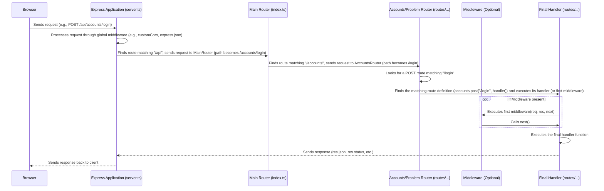

# Chapter 8: API Routing

Welcome back to the FireCode tutorial! In the [previous chapter, Chapter 7: Middleware](07_middleware_.md), we learned about those helpful functions that act like checkpoints or processing steps for incoming requests on the backend, handling things like ensuring friendly communication with the frontend (CORS) and verifying if a user is logged in (authentication).

Now that a request has potentially passed through some middleware, how does the backend server know which specific block of code is supposed to handle *this particular request*? If a request arrives asking for the list of problems, we need to run the code that fetches problems from the database. If a request arrives with a user's code submission, we need to run the code that executes the code and saves the result.

Imagine the FireCode backend server as a building that receives all sorts of mail (incoming requests). Each piece of mail has an address (the URL) and might be marked "URGENT" (the HTTP method). Someone at the entrance needs to look at the address and the urgency mark and route that mail to the correct department inside the building that knows how to process exactly that type of mail.

**API Routing** is this critical routing system. It's the mechanism on the backend that looks at the incoming request's **URL** and its **HTTP Method** (like GET, POST, etc.) and directs that request to the specific function or set of functions (including middleware and the final handler) designed to handle it. It's the map that tells the server where to send each incoming call.

**What Problem Does This Solve?**

Without a clear routing system:
*   The server wouldn't know what to do with an incoming request. It wouldn't know which piece of code corresponds to `/api/problemset` versus `/api/accounts/login` versus `/api/problem/submit/:name`.
*   You couldn't have different actions happen at the same URL based on the request type (e.g., a `GET` request to `/users` might list users, while a `POST` request to `/users` might create a new user).

API Routing solves this by providing a structured way to define these mappings between request characteristics (URL + Method) and the code that handles them. It acts as the central dispatcher for your backend API.

**Key Concepts**

API Routing involves a few core ideas:

1.  **Endpoints (URLs):** These are the specific web addresses on your backend server that the frontend application (or any client) sends requests to. Examples in FireCode include `/api/problem/all`, `/api/accounts/login`, `/api/problem/:name/editorial`.
2.  **HTTP Methods:** These indicate the type of action the client wants to perform. The most common ones are:
    *   `GET`: Retrieve data (e.g., get a list of problems, get problem details).
    *   `POST`: Send data to create or update something (e.g., create a new account, submit code).
    *   `PUT`/`PATCH`: Update existing data.
    *   `DELETE`: Remove data (e.g., delete an account).
3.  **Route Definitions:** This is where you tell your backend framework (Express, in FireCode's case) to match a specific HTTP method and URL path to a particular function (or sequence of middleware and a final handler function).
4.  **Route Handlers:** These are the actual functions that contain the logic to process the request once it's been routed. They access data from the request (URL parameters, body, headers) and prepare and send the response back to the client.

**How FireCode Uses API Routing**

FireCode's backend uses the Express framework, which makes defining API routes straightforward. The route definitions essentially create a map. When a request arrives, Express looks at the method and path, finds the matching entry in the map, and then executes the associated function(s).

Let's see how this map is built and used in FireCode's backend code (`server/`).

**1. Defining Specific Routes**

The main place specific routes are defined is within files in the `server/routes/` directory, like `server/routes/problem.ts` and `server/routes/accounts.ts`. These files typically create a mini-application or "router" using `express.Router()`.

Here's a look at how some routes are defined in `server/routes/accounts.ts`:

```typescript
// server/routes/accounts.ts (Simplified Snippet)
import express from "express";
// ... imports (UserModel, bcrypt, authenticateToken, etc.) ...

const accounts = express.Router(); // Create a new Router for account-related routes

// Define a POST route for the /signup path
accounts.post("/signup", async (req, res) => {
    // This function runs when a POST request hits /signup
    const { username, email, password } = req.body; // Get data from the request body
    // ... signup logic (validation, hashing, saving to DB - Chapter 3 & 6) ...
    res.status(201).json({ success: true, message: "Account created" });
});

// Define a POST route for the /login path
accounts.post("/login", async (req, res) => {
    // This function runs when a POST request hits /login
    const { username_or_email, password } = req.body; // Get data from the request body
    // ... login logic (find user, compare password, generate token - Chapter 3 & 6) ...
    res.json({ success: true, token: "...", id: "..." });
});

// Define a POST route for the /delete/:id path
// This route also includes the authenticateToken middleware (Chapter 7)
accounts.post("/delete/:id", authenticateToken, async (req, res) => {
    // This function runs AFTER authenticateToken, for a POST request to /delete/...
    const { id } = req.params; // Get dynamic value 'id' from the URL path
    // ... delete user logic (find and delete from DB - Chapter 3 & 6) ...
    res.json({ success: true, message: "Account deleted" });
});

// Define a GET route for the /id/:id path
// This route also includes the authenticateToken middleware (Chapter 7)
accounts.get("/id/:id", authenticateToken, async (req, res) => {
    // This function runs AFTER authenticateToken, for a GET request to /id/...
    const id = req.params.id; // Get dynamic value 'id' from the URL path
    // ... fetch user by id logic (find in DB - Chapter 3 & 6) ...
    res.json(user); // Send user data back
});

// Define a GET route for the /:name path
// This route does NOT have the authenticateToken middleware
accounts.get("/:name", async (req, res) => {
     // This function runs directly for a GET request to /... (where ... is treated as name)
    const name = req.params.name; // Get dynamic value 'name' from the URL path
    // ... fetch public user data by name logic (find in DB - Chapter 3 & 6) ...
    res.json(publicUser); // Send public user data back
});

export default accounts; // Export this Router instance
```

Let's break down the syntax for a typical route definition:

```typescript
accounts.post("/signup", async (req, res) => { /* ... handler code ... */ });
```

*   `accounts`: This is the Express Router instance we created. We attach routes to it.
*   `.post`: This specifies the **HTTP Method** this route will handle. If a request with a different method (like `GET`) comes to this path, it won't match this route definition. Other methods would be `.get`, `.put`, `.delete`, etc.
*   `"/signup"`: This is the **URL path** (relative to where this router is "mounted"). The request's URL path must match this string.
*   `async (req, res) => { ... }`: This is the **Route Handler function**. This function will be executed if the request matches both the method (`POST`) and the path (`/signup`). It receives the request (`req`) and response (`res`) objects, allowing it to access request data and send a response. We use `async` because the handler performs asynchronous operations like database calls.

**Handling Dynamic URLs (`req.params`)**

Notice the routes like `/delete/:id` and `/id/:id` and `/:name`. The colon (`:`) signifies a **route parameter**.

```typescript
accounts.get("/id/:id", authenticateToken, async (req, res) => {
    const id = req.params.id; // Access the value captured by :id
    // ... use the 'id' variable to fetch data ...
});
```
When a request like `GET /api/accounts/id/12345` arrives, Express matches the `/id/:id` pattern. It captures the value `12345` and makes it available in the `req.params` object. So, inside the handler, `req.params.id` will be `"12345"`. This allows the same route definition to handle requests for different user IDs or problem names.

**Accessing Request Data (`req.body`, `req.query`)**

Beyond the URL path, requests often carry data:

*   `req.body`: Contains data sent in the request body, commonly used with `POST` or `PUT` requests for sending forms or JSON data (like login credentials or code submissions). You need middleware like `express.json()` (see `server/server.ts`) to parse the body into a usable JavaScript object.
*   `req.query`: Contains data sent as query parameters in the URL (e.g., `/api/problem/all?search=two-sums&difficulty=easy`). If the URL was `/api/problem/all?search=two-sums&difficulty=easy`, then `req.query` would be `{ search: 'two-sums', difficulty: 'easy' }`.

We saw `req.body` used in the `/signup` and `/login` examples above (`req.body.username`, `req.body.password`), and `req.query` used in the `/api/problem/all` route handler in [Chapter 5: Problem Management](05_problem_management_.md) to get search and sort filters.

**Integrating Middleware**

As seen in [Chapter 7: Middleware](07_middleware_.md), middleware functions can be included in the route definition *before* the final handler:

```typescript
accounts.post("/delete/:id", authenticateToken, async (req, res) => { /* ... */ });
```
When a `POST` request hits `/api/accounts/delete/:id`, Express first executes the `authenticateToken` middleware. Only *if* `authenticateToken` calls `next()` will the `async (req, res) => { ... }` handler function be executed. If `authenticateToken` sends a response (due to a missing or invalid token), the handler is skipped. This is a powerful pattern for adding layers of processing or security before the core logic runs.

**2. Combining Routers**

Instead of defining *all* routes in one giant file, FireCode uses separate routers for different areas (accounts, problems). These smaller routers are then combined and attached to the main Express application.

This happens in `server/routes/index.ts`:

```typescript
// server/routes/index.ts
import express from "express";
import problemRouter from "./problem"; // Import the Router from problem.ts
import accountsRouter from "./accounts"; // Import the Router from accounts.ts

const router = express.Router(); // Create a main Router

// Mount the problemRouter at the /problem path
router.use("/problem", problemRouter);

// Mount the accountsRouter at the /accounts path
router.use("/accounts", accountsRouter);

export default router; // Export the main combined Router
```
*   `problemRouter` is the `express.Router()` instance exported from `server/routes/problem.ts`.
*   `accountsRouter` is the `express.Router()` instance exported from `server/routes/accounts.ts`.
*   The main `router.use("/problem", problemRouter)` line tells this main router: "Any request that starts with `/problem` should be sent to the `problemRouter` to handle the rest of the path." So, a request to `/problem/all` is handled by the `problemRouter` looking for the `/all` path. A request to `/problem/:name` is handled by the `problemRouter` looking for the `/:name` path.
*   Similarly, `router.use("/accounts", accountsRouter)` routes requests starting with `/accounts` to the `accountsRouter`.

**3. Attaching the Main Router to the App**

Finally, the main combined router is attached to the core Express application in `server/server.ts`.

```typescript
// server/server.ts (Simplified Snippet)
require("dotenv").config();
import express from "express";
import mainRouter from "./routes/index"; // Import the main combined Router
// ... imports for middleware (customCors), database connection ...

const app: express.Application = express();
// ... database connection ...

// Use middleware that applies to most/all requests (Chapter 7)
app.use(customCors);
app.use(express.json()); // Middleware to parse JSON request bodies

// Attach the mainRouter at the /api path
app.use("/api", mainRouter);

app.listen(/* ... */); // Start the server
```
The line `app.use("/api", mainRouter)` tells the main `app`: "Any request that starts with `/api` should be sent to the `mainRouter` to handle the rest of the path."

Combining these steps:
*   A request like `POST /api/accounts/login` hits the server.
*   `app.use("/api", mainRouter)` directs it to `mainRouter`, stripping `/api`.
*   `mainRouter.use("/accounts", accountsRouter)` directs it to `accountsRouter`, stripping `/accounts`.
*   `accountsRouter` then looks for a `POST` route matching `/login`.
*   It finds `accounts.post("/login", ...)` and executes its handler function.

This layered approach keeps the routing organized and modular.

**How it Works Under the Hood (Simplified Routing Flow)**

Let's trace a request from the browser to the final handler:



1.  A request (e.g., `POST` to `/api/accounts/login`) leaves the browser.
2.  The FireCode backend server (the Express application defined in `server.ts`) receives it.
3.  The request first passes through any middleware applied globally with `app.use()` (like `customCors` and `express.json`). `express.json()` parses the request body so `req.body` is available.
4.  The `app.use("/api", mainRouter)` line matches the `/api` part of the path and directs the request to the `mainRouter`, with the remaining path `/accounts/login`.
5.  Inside the `mainRouter`, the `router.use("/accounts", accountsRouter)` line matches `/accounts` and directs the request to the `accountsRouter`, with the remaining path `/login`.
6.  Inside the `accountsRouter`, Express looks for a route definition that matches the request's HTTP method (`POST`) and the remaining path (`/login`).
7.  It finds the `accounts.post("/login", async (req, res) => { ... })` definition.
8.  Since this route definition doesn't have any specific middleware listed *before* the handler, Express directly executes the `async (req, res) => { ... }` handler function. (If there were middleware, like `authenticateToken` on the `/delete/:id` route, the middleware would run first, and the handler would only run if the middleware called `next()`).
9.  The handler function processes the request (e.g., checks credentials, queries the database - [Chapter 6](06_data_persistence__mongodb_mongoose__.md)), and sends a response using `res.json()` or `res.status().send()`.
10. The response travels back through the chain (though typically doesn't trigger middleware in the same way on the return path) and is sent back to the browser.

This entire process, orchestrated by Express's routing system, ensures that each request is directed to the correct code for processing.

**Conclusion**

In this chapter, we explored **API Routing**, the fundamental system that maps incoming backend requests (based on their URL and HTTP method) to the specific code handlers responsible for processing them. We saw how Express Routers (`express.Router()`) are used to define these mappings in files like `server/routes/accounts.ts` and `server/routes/problem.ts`. We learned how to define routes using different HTTP methods (`.get`, `.post`), capture dynamic parts of the URL using route parameters (`:id`, `:name`), and access request data from the body (`req.body`) and query parameters (`req.query`). We also revisited how [Middleware](07_middleware_.md) is integrated into the routing chain and saw how individual routers are combined into a main router (`server/routes/index.ts`) and attached to the main application (`server/server.ts`) to create a structured API.

Understanding API Routing is essential for building a well-organized backend that can respond correctly to different types of requests from the frontend.

Now that we know how requests are routed to specific handlers, let's look at some of the smaller, reusable helper functions that are often used *within* these handlers (and other parts of the code) to perform common tasks more efficiently.

Let's move on to [Chapter 9: Utility Functions](09_utility_functions_.md)!

---

Generated by [AI Codebase Knowledge Builder](https://github.com/The-Pocket/Tutorial-Codebase-Knowledge)