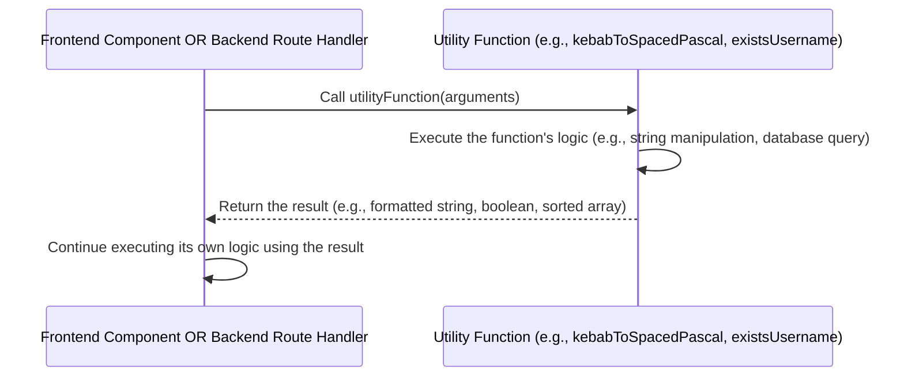

# Chapter 9: Utility Functions

Welcome back, FireCoder! In the [previous chapter, Chapter 8: API Routing](08_api_routing_.md), we explored how the backend server intelligently directs incoming requests to the right code handlers based on the URL and method. We saw how specific routes like `/api/accounts/login` or `/api/problem/all` trigger different functions to run.

Now, let's zoom in even further. Once a request reaches its specific handler function (or when a component is rendering on the frontend), there are often small, repetitive tasks that need to be done. Maybe you need to format a string in a specific way, convert some text from one format to another, or perform a common action like clearing some data from the browser's storage.

Imagine your toolbox. You have big power tools for major construction (like routing or database operations), but you also have smaller, versatile hand tools – screwdrivers, wrenches, pliers – that you reach for frequently to handle small, specific jobs. You don't rebuild a screwdriver every time you need one; you just grab the one you already have.

**Utility Functions** are these smaller, versatile hand tools in FireCode's codebase. They are small, reusable pieces of code designed to perform specific, common tasks that aren't tied to the core logic of a particular feature (like user authentication or code execution). They are like helper functions you can grab and use whenever you need that specific small job done.

**What Problem Do Utility Functions Solve?**

Without utility functions, you'd end up writing the same small pieces of code over and over again in different parts of your application.

For example:
*   If you need to convert a problem name like `"two-sums"` into a display title like `"Two Sums"` in multiple places (on the problem list, on the problem page), you'd either copy and paste the conversion logic or rebuild it each time.
*   If both the login page and the signup page need to save or clear a user token in the browser's local storage, repeating that storage logic in both places is inefficient.

Utility functions solve this by encapsulating this small, reusable logic into a single function. You write the function once, test it thoroughly, and then you can "import" and use it anywhere it's needed, ensuring consistency and avoiding repetitive code.

**Key Concepts**

1.  **Small and Focused:** Each utility function typically does one thing, and does it well (like converting a string case, checking if a value exists, or formatting some data).
2.  **Reusable:** They are designed to be used in many different parts of the application (both frontend and backend, although they are often separated into frontend-specific and backend-specific utilities).
3.  **Not Core Logic:** They don't handle the main business logic (like processing a submission or authenticating a user). They assist the core logic by providing helper functionality.
4.  **Organized in "Utils" Folders:** You'll typically find them grouped together in directories named something like `src/ts/utils/` (for frontend utilities) or `server/utils/` (for backend utilities).

**How FireCode Uses Utility Functions**

FireCode has several utility functions spread across its frontend and backend. Let's look at a few examples from the provided code snippets:

**Example 1: Formatting Strings (Frontend)**

On the frontend, FireCode needs to display problem names nicely. The problem data might store names in a web-friendly format like `kebab-case` (`"two-sums"`), but the UI might need a more readable format like `"Two Sums"`.

The `src/ts/utils/string.ts` file contains various string manipulation utilities, including `kebabToSpacedPascal`:

```typescript
// src/ts/utils/string.ts (Snippet)
/**
 * Converts a string from kebab-case to spaced PascalCase.
 * @example
 * // Returns "Two Sums"
 * kebabToSpacedPascal("two-sums");
 */
export function kebabToSpacedPascal(str: string) {
    if (str == null) return ""; // Handle null/undefined input
    let spliced = str.split("-"); // Split by the hyphen: ["two", "sums"]
    let upperCasedFirstChars = spliced.map((str) => {
        // For each word: take the first char, uppercase it, add the rest lowercase
        return str.charAt(0).toUpperCase() + str.slice(1).toLowerCase();
    }); // Result: ["Two", "Sums"]
    return upperCasedFirstChars.join(" "); // Join with a space: "Two Sums"
}
```
This small function takes a string like `"two-sums"` and returns `"Two Sums"`. Any frontend component that needs to display a problem name in this format can import and use this function instead of writing the splitting, mapping, and joining logic themselves.

A component might use it like this:

```typescript
// SomeProblemDisplayComponent.tsx (Conceptual Snippet)
import { kebabToSpacedPascal } from "../ts/utils/string"; // Import the utility

interface ProblemProps {
    problemName: string; // e.g., "two-sums"
}

const SomeProblemDisplayComponent = ({ problemName }: ProblemProps) => {
    const displayTitle = kebabToSpacedPascal(problemName); // Use the utility function!

    return (
        <div>
            <h1>{displayTitle}</h1> {/* Displays "Two Sums" */}
            {/* ... rest of component ... */}
        </div>
    );
};
```
This keeps the component's code focused on *displaying* the problem, not on the details of *how* to format its name.

The `src/ts/utils/string.ts` file also contains a more general `changeCase` function with many different case conversion options (`camel`, `pascal`, `snake`, etc.), demonstrating how related utility functions can be grouped.

**Example 2: Handling Browser Storage (Frontend)**

Sometimes, after a user logs out or deletes their account, you need to remove sensitive information like their authentication token and user ID from the browser's `localStorage`.

The `src/ts/utils/utils.ts` (frontend) file contains a utility for this:

```typescript
// src/ts/utils/utils.ts (Frontend Snippet)
export function deleteTokenAndId(token: string, id: string) {
    if (!token || !id) return; // Basic safety check
    localStorage.removeItem(token); // Remove the item associated with the token key
    localStorage.removeItem(id);   // Remove the item associated with the ID key
}
```
This function simply removes two specific items from `localStorage` based on the provided keys. Any part of the frontend that needs to log a user out can call this single function, ensuring that the token and ID are consistently cleared.

A component (like a Logout button handler) might use it:

```typescript
// src/components/MainHeading.tsx (Conceptual Snippet)
// ... imports ...
import { deleteTokenAndId } from "../ts/utils/utils"; // Import the utility
import { useNavigate } from "react-router-dom"; // Chapter 1

const MainHeading = ({ userToken, userId, setToken, setId }) => {
    const navigate = useNavigate();

    const handleLogout = () => {
        // Clear data from browser storage using the utility
        deleteTokenAndId(userToken, userId); // Use the utility function!

        // Update state to reflect logged out status
        setToken(null);
        setId(null);

        // Navigate to the login page (Chapter 1)
        navigate("/login");
    };

    return (
        <header>
            {/* ... header content ... */}
            {userToken && <button onClick={handleLogout}>Logout</button>}
        </header>
    );
};
```
Again, the component uses the utility function for the specific task of clearing storage, keeping its own logic simple.

**Example 3: Sorting Data (Backend)**

In [Chapter 5: Problem Management](05_problem_management_.md), we saw how the backend route `/api/problem/all` fetches problems from the database and then needs to sort them based on parameters from the request (like difficulty or acceptance rate). Instead of writing the sorting logic directly inside the route handler, utility functions are used.

The `server/utils/utils.ts` (backend) file contains sorting utilities:

```typescript
// server/utils/utils.ts (Backend Snippet)
import { Document, Types } from "mongoose";
import { DProblem } from "../models/problem"; // Problem data structure (Chapter 6)

// Define a helper type for clarity
type ProblemDocument = Document<unknown, {}, DProblem> & DProblem & { _id: Types.ObjectId };
type SortOrder = "" | "asc" | "desc"; // Define possible sort orders

export function sortByDifficulty(
    order: SortOrder, // e.g., "asc" or "desc"
    arr: ProblemDocument[] // The array of problems to sort
): ProblemDocument[] {
    if (order === "") return arr; // Return unsorted if no order specified
    const difficultyRule = { easy: 1, medium: 2, hard: 3 }; // Assign numerical value to difficulty

    if (order === "asc") {
        // Sort in ascending order (easy first)
        return arr.sort((a, b) =>
            difficultyRule[a.main.difficulty] - difficultyRule[b.main.difficulty]
        );
    } else {
        // Sort in descending order (hard first)
        return arr.sort((a, b) =>
            difficultyRule[b.main.difficulty] - difficultyRule[a.main.difficulty]
        );
    }
}

// sortByAcceptance and sortByTitle functions follow similar patterns...
export function sortByAcceptance(/* ... */): ProblemDocument[] { /* ... sort logic ... */ }
export function sortByTitle(/* ... */): ProblemDocument[] { /* ... sort logic ... */ }
```
This function `sortByDifficulty` takes an array of problem documents and a desired sort order (`"asc"` or `"desc"`) and returns the *sorted* array. It contains the specific logic for comparing problem difficulty.

The `/api/problem/all` route handler ([Chapter 5](05_problem_management_.md)) uses these utilities:

```typescript
// server/routes/problem.ts (Snippet - Get all problems route)
// ... imports (ProblemModel, UserModel, sortByDifficulty, sortByAcceptance, sortByTitle) ...

problem.post("/all", async (req, res) => {
    // ... get search, difficulty, acceptance, title from req.query ...

    try {
        // 1. Query the database to get problems (Chapter 6)
        const allProblems = await ProblemModel.find(/* ... */).exec();

        // 2. Sort the problems using utility functions!
        const allProblemsSorted = sortByAcceptance(
            acceptance.toString() as Sort,
            sortByDifficulty(
                difficulty.toString() as Sort,
                sortByTitle(title.toString() as Sort, allProblems)
            )
        );

        // 3. Fetch user data and add status (Chapter 5) ...

        // 4. Send the final sorted list ...
        res.json(allProblemsArray);
    } catch (e) {
        // ... error handling ...
    }
});
```
The route handler fetches the data and then hands it off to the sorting utilities. This makes the route handler cleaner and keeps the complex sorting logic separate and reusable.

**Example 4: Database Existence Checks (Backend)**

When a new user signs up, the backend needs to check if the desired username or email already exists in the database. This is a specific type of database query.

The `server/utils/utils.ts` (backend) file has utilities for this:

```typescript
// server/utils/utils.ts (Backend Snippet)
import UserModel from "../models/user"; // User model (Chapter 6)

export async function existsUsername(username: string): Promise<boolean> {
    // Use the UserModel to find one user with the given username
    const user = await UserModel.findOne({ username: username }); // Database read operation (Chapter 6)
    // If user is null, the username does NOT exist, so return true if user is NOT null
    return user != null;
}

export async function existsEmail(email: string): Promise<boolean> {
    // Use the UserModel to find one user with the given email
    const user = await UserModel.findOne({ email: email }); // Database read operation (Chapter 6)
    // Return true if a user with this email exists
    return user != null;
}
```
These functions take a username or email, perform a database query ([Chapter 6](06_data_persistence__mongodb_mongoose__.md)) using the `UserModel`, and return a simple `true` or `false` indicating if a user with that credential already exists.

The signup route handler ([Chapter 3](03_user_authentication_and_accounts_.md)) uses these:

```typescript
// server/routes/accounts.ts (Snippet - Signup route)
// ... imports (UserModel, bcrypt, existsUsername, existsEmail) ...

accounts.post("/signup", async (req, res) => {
    const { username, email, password } = req.body;

    try {
        // 1. Use the utility function to check if username exists
        if (await existsUsername(username)) {
            res.status(409).json({ success: false, message: "Username exists." });
            return; // Stop processing this request
        }
        // 2. Use the utility function to check if email exists
        if (await existsEmail(email)) {
            res.status(409).json({ success: false, message: "Email exists." });
            return; // Stop processing this request
        }

        // ... rest of signup logic (hashing password, creating/saving user - Chapter 3 & 6) ...
        res.status(201).json({ success: true, message: "Account created successfully" });

    } catch (e) {
        // ... error handling ...
    }
});
```
The signup handler becomes much cleaner because the details of performing the database check are hidden inside the `existsUsername` and `existsEmail` utility functions.

**How it Works Under the Hood (Simplified)**

Utility functions are the simplest concept in terms of "under the hood" complexity compared to routing or middleware. Calling a utility function is just like calling any other function in JavaScript.



1.  Some code (either in a frontend component, a backend route handler, or another function) needs to perform a specific, common task.
2.  It calls the relevant utility function, passing any necessary arguments.
3.  The utility function executes its code. This might involve simple calculations, string manipulations, or (in the case of backend utilities that interact with the database or external services) making further calls to other libraries or systems ([Chapter 6: Data Persistence](06_data_persistence__mongodb_mongoose__.md)).
4.  Once the utility function completes its task, it returns the result of that task back to the code that called it.
5.  The calling code then continues its execution, using the result provided by the utility function.

There's no special routing, no request/response pipeline, just a direct function call. This is why utility functions are great for isolating small, testable pieces of logic.

**Conclusion**

In this chapter, we learned about **Utility Functions**, the versatile hand tools of the FireCode codebase. We saw that they are small, reusable functions that perform specific, common tasks like formatting strings (`kebabToSpacedPascal`), handling browser storage (`deleteTokenAndId`), sorting data (`sortByDifficulty`), or performing basic checks (`existsUsername`). By grouping these functions in `utils` folders and using them throughout the application, FireCode avoids code repetition, keeps its main components and handlers cleaner, and makes the code easier to maintain and test.

This concludes our exploration of the core abstractions in the FireCode project! We've journeyed from understanding the structure of frontend pages and navigation, the building blocks of the UI components, how users are managed and authenticated, the engine behind code execution and submission, the system for managing coding problems, where all the data is permanently stored and how we access it using MongoDB/Mongoose, how backend requests are processed layer by layer with middleware, and finally how those requests are directed to the correct code via API routing. We wrapped up by looking at the small, reusable helper functions that support all these larger systems.

You now have a foundational understanding of the major parts of the FireCode application and how they work together!